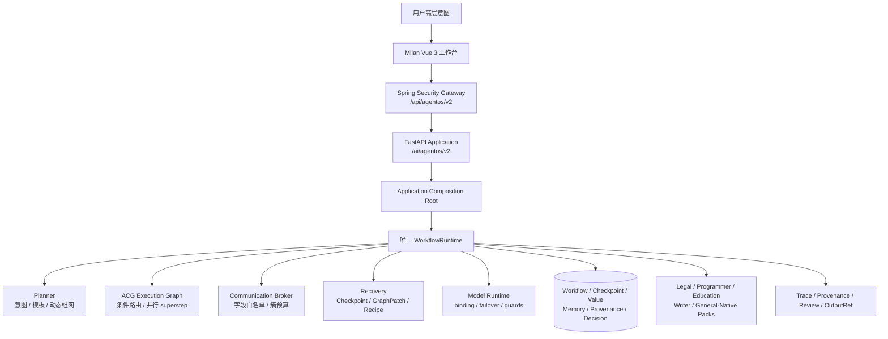

<p align="center">
  
</p>

<h1 align="center">知弈 AgentOS</h1>

<p align="center">
  <strong>面向超长程复杂任务的动态异构群体智能运行时<br>让多 Agent 在一个可规划、可通信、可恢复、可审计的执行真源中完成复杂工作</strong>
</p>

<p align="center">
  
  
  
  
</p>

<p align="center">
  
  
  
  
  
</p>

---

## 项目简介

知弈 AgentOS 面向荣耀终端股份有限公司发布的挑战杯赛题 **XH-202631：面向超长程复杂任务的动态异构群体智能架构与深度协同推理技术**。

比赛方案要求系统从“高维模糊的自然语言意图”出发，在复杂非确定性环境中完成全链路闭环交付，并重点突破：

- 超长程上下文连续性与分布式记忆保持；
- 动态异构拓扑与低熵通信；
- 端、边、云异构资源自适应调度；
- 异常、需求变化和节点失效下的自主恢复；
- 中间决策过程、推理轨迹和最终产物的可视化展示。

知弈的核心答案是 **Agentic Computation Graph（ACG）**。系统把 Step、Agent、Skill、Memory、Evidence 和 Control 建模为有类型节点，把依赖、通信、控制、读写和证据支撑建模为不同类型的边；再由唯一的 WKN `WorkflowRuntime` 完成规划、调度、执行、恢复和审计。

> 比赛原始依据：[《面向超长程复杂任务的动态异构群体智能架构与深度协同推理技术比赛方案》](docs/01-赛题与项目概述/比赛方案.pdf)

---

## 为什么选择知弈？

| 长程群体智能瓶颈 | 常见结果 | 知弈的工程机制 |
|:---|:---|:---|
| 注意力稀释与记忆坍缩 | 目标漂移、中间结论丢失、恢复后上下文断裂 | 独立 Memory / Evidence Store、Checkpoint CAS、Evidence Memory、引用式状态 |
| 全连接通信与 Token 爆炸 | 无关信息广播、噪声级联、成本失控 | Communication Broker、稀疏拓扑、字段白名单、熵预算、ContextPack |
| 静态流水线不能应对变化 | 需求变化或节点失败后只能整链重跑 | GraphPatch、review barrier、局部恢复、Recovery Recipe、alternate rebind |
| 多模型和异构能力不可治理 | 模型漂移、版本不兼容、故障切换失控 | AgentProfile binding、版本协商、健康刷新、failover、key rotation、runtime guards |
| 只交付最终文本 | 无法解释、复核或追责 | Trace、Provenance、Checkpoint、Review、`outputRef` 解引用 |

知弈不是“更多 Agent + 更长 Prompt”的组合，而是一套让群体智能长期运行仍能保持边界、证据和恢复能力的统一运行时。

---

## 赛题能力对齐

### 答题要求

| 比赛方案要求 | 当前实现 | 状态 |
|:---|:---|:---:|
| 超长程上下文连续性与记忆保持 | 六类独立 Store、Checkpoint CAS、Evidence Memory、引用式输出、restart recovery | ✅ 已实现并有测试 |
| 动态异构拓扑与低熵通信 | ACG、conditional routing、parallel superstep、Communication Broker、字段级投递、Provenance | ✅ 已实现并有测试 |
| 动态异常与需求变更 | GraphPatch、review barrier、contract repair、Recovery Recipe、orphan reference ownership | ✅ 已实现并有测试 |
| 多模型兼容与角色扩展 | AgentProfile binding、模型 failover、版本协商、健康刷新、Pack 注册 | ✅ 已实现并有测试 |
| 端-边-云资源自适应调度 | ResourceDirectory、PluginScopeResolver、资源与隐私约束基础 | 🚧 调度基础已具备，真实端边云部署与模型切分待验收 |
| 典型产业场景验证 | Legal 黄金纵切；Programmer、Education、Writer、General/Native Packs | 🚧 法律链路完整，第二个高完成度跨领域长任务仍需比赛级演示 |
| 决策过程与推理轨迹展示 | Milan Workbench、Graph、Trace、Provenance、Checkpoint、Review、Output | ✅ 已完成 |

### 评分标准映射

比赛初审与终审采用同一标准，分别占最终成绩的 40% 和 60%。项目按四项评分维度组织后续验收：

| 评分维度 | 分值 | 当前证据 | 比赛前重点 |
|:---|---:|:---|:---|
| 作品完整性 | 40 | 感知-规划-执行-反馈闭环；单一 Runtime；Legal 黄金纵切；多领域 Pack | 补齐 2 个以上高完成度跨领域长任务，形成数千步稳定演示 |
| 应用创新性 | 25 | Milan 可视化工作台；法律、编程、教育、写作等领域扩展边界 | 量化真实业务节省、用户学习成本和社会价值 |
| 技术创新性 | 20 | ACG、低熵 Broker、GraphPatch、Evidence Memory、恢复与治理 | 给出核心算法伪代码、复杂性分析和对照实验 |
| 系统性能与效率 | 15 | guarded runtime、failover、并行 superstep、结构化通信 | 建立成功率、Token、耗时、兼容性和异常恢复基准 |

---

## 核心架构



### 一条真实请求链

```text
Milan Frontend
  -> Spring Security /api/agentos/v2
  -> Python FastAPI /ai/agentos/v2
  -> Application Coordinator
  -> WKN WorkflowRuntime
  -> ACGNodeRunner / Communication Broker / Stores
```

生产代码只有一个 `WorkflowRuntime` 和一个执行真源，不包含 C4 `RuntimeGraph`、旧 `ACGExecutor`、第二套 Executor 或旧 `/core` AgentOS API。

---

## 核心能力

### 1. ACG 动态异构拓扑

- `DEPENDENCY` 边决定就绪集与并行执行；
- `COMMUNICATION` 边声明允许的数据通道；
- `CONTROL_FLOW` 表达条件、分支、汇聚和 Review；
- `READ` / `WRITE` / `SUPPORT` 连接记忆与证据；
- `GraphPatch` 在安全 review barrier 上进行版本化、不可变拓扑变更。

### 2. 低熵通信

Agent 不直接相互广播自然语言全文。Communication Broker 依据拓扑、字段白名单、作用域与熵预算向下游投递最小 `ContextPack`，Provenance 同步记录生产者、消费者、字段、校验和及证据引用。

### 3. 长程记忆与引用式状态

Workflow、Checkpoint、Execution Value、Evidence Memory、Provenance、Decision 分库存储。Run DTO 只返回运行摘要和引用，正文通过 `outputRef` 解引用，避免把 ContextPack、模型内部状态或工具原文重新塞回长程状态。

### 4. 自主恢复

```text
故障或需求变化
  -> guarded runtime 分类与审计
  -> Checkpoint CAS
  -> Recovery Recipe / contract repair / alternate rebind
  -> 必要时应用 GraphPatch
  -> 保持同一 run_id 和 reference ownership 继续执行
```

### 5. 多模型与外部能力治理

模型调用在冻结的 execution binding 下执行，支持能力与版本约束、异步健康刷新、主备 failover、key rotation、超时与重试。`commitId` 在重试和 failover 中保持稳定，并作为外部幂等键透传。

### 6. Milan 可视化闭环

工作台提供 Run history、Graph、Trace、Provenance、Checkpoint、Review 和 Output 视图。高风险节点可进入 `WAITING_REVIEW`，审核后从原运行恢复，而不是任意恢复历史 checkpoint。

---

## 产业验证场景

### Legal：合同审查黄金纵切

```text
合同输入
  -> 条款解析与分类
  -> 风险识别
  -> 证据与法规匹配
  -> 修改建议
  -> 人工复核
  -> 引用式审查报告
```

该场景验证动态图执行、结构化通信、证据血缘、Review、Checkpoint 和恢复的组合行为。法律输出仅作为辅助材料，不构成正式法律意见。

### 多领域扩展

Programmer、Education、Writer、General/Native 已按同一 WKN Pack 边界注册，证明内核与领域逻辑解耦。比赛评分要求 2 个以上高完成度跨领域长任务；因此第二条比赛级黄金纵切仍是明确交付门禁，不能仅以“Pack 已存在”替代真实演示。

---

## 快速开始

### Windows 11 + Docker Desktop

Docker Desktop 使用 Linux containers。敏感配置必须保存在本地 `.secrets/`，不得提交到 Git。

```powershell
Copy-Item .env.windows.example .env.windows
py -3 -m scripts.infra.init_secrets .secrets/kinlin-win-dev-001

# 至少在 Secret 目录配置一个真实模型 Key 后再发起模型调用
.\scripts\infra\windows\up.ps1 -Build
```

默认入口：<http://127.0.0.1:8080>

```powershell
.\scripts\infra\windows\status.ps1
.\scripts\infra\windows\logs.ps1
.\scripts\infra\windows\up.ps1 -DebugPorts
.\scripts\infra\windows\restart-service.ps1 -Service backend
.\scripts\infra\windows\preflight.ps1 -Full
.\scripts\infra\windows\down.ps1
```

> `remove-data-volumes.ps1` 会删除持久化数据，不属于日常停止流程。除非已完成备份且明确需要重置环境，否则不要运行。

### 前端热更新

```powershell
.\scripts\infra\windows\up.ps1 -DebugPorts
Set-Location frontend
npm ci
$env:DEV_BACKEND_PROXY_TARGET = "http://127.0.0.1:18080"
npm run dev
```

前端开发服务默认位于 <http://localhost:3000>。

### Linux / macOS

```bash
cp .env.example .env
python3 -m scripts.infra.init_secrets .secrets/kinlin-dev-local
export KINLIN_DEPLOYMENT_ID=kinlin-dev-local
export KINLIN_SECRETS_DIR="$PWD/.secrets/kinlin-dev-local"
./dev.sh up
```

---

## 验证基线

2026-08-19 稳定候选回归结果：

| 测试层 | 结果 |
|:---|---:|
| AgentOS Kernel | **187 passed** |
| Python Application / Packs / AgentOS v2 API | **102 passed, 1 skipped** |
| Spring Gateway | **132 passed** |
| Milan Frontend | **24 files, 115 tests passed** |
| Frontend production build | **成功，3134 modules** |
| infra / release | **49 passed** |
| Docker compose | Windows dev/prod 配置验证通过 |
| 五服务健康检查 | frontend/backend/ai-service/postgres/redis 全部 healthy |
| authenticated E2E | 未认证 401；认证后 `frontend -> Spring -> Python` 返回 200 |

运行 Python 回归：

```powershell
Set-Location agentOS
py -3.14 -m pytest tests -q

Set-Location ..\agent
py -3.14 -m pytest tests -q
```

完整三线收束证据见 [正式集成报告](agentOS/docs/migration/reports/wkn-c4-milan-stable.md)。

---

## 项目结构

```text
知弈 AgentOS
├── frontend/                    # Milan Vue 3 产品外壳与 AgentOS 工作台
├── backend/                     # Spring Security 与 AgentOS v2 公共网关
├── agent/
│   ├── app/api/                 # FastAPI AgentOS v2 边界
│   ├── app/execution/           # 唯一 Application composition root
│   └── packs/                   # 领域 Agent Packs
├── agentOS/
│   ├── src/runtime/             # 唯一 WKN WorkflowRuntime
│   ├── src/components/planner/  # 规划与 ACG 构建
│   ├── src/components/executor/ # ACG 节点执行、GraphPatch、值引用
│   ├── src/components/communicator/ # Broker、ContextPack、Provenance
│   ├── src/components/recovery/ # Checkpoint、Recipe、恢复计划
│   ├── src/components/memory/   # Evidence Memory
│   ├── src/components/resource/ # 资源目录与作用域解析
│   ├── src/adapters/            # 模型、工具与外部运行时适配
│   └── src/contracts/           # reference-first 合同
├── docker/                      # 镜像、入口与备份/恢复实现
├── scripts/infra/               # 部署、预检、诊断、发布脚本
└── docs/                        # 赛题、架构、演示与交付文档
```

---

## 比赛交付路线

比赛方案要求在 2026 年 9 月 15 日前向发榜单位提交审核通过的报名表和全部作品材料。README 以技术事实为入口，正式提交还需要持续维护以下证据：

- [x] 一个 WKN 内核、一个 Runtime、一个 AgentOS v2 API；
- [x] 动态拓扑、低熵通信、记忆、恢复、Trace/Provenance 的自动化回归；
- [x] Milan 可视化工作台和可部署五服务环境；
- [x] Legal 黄金纵切；
- [ ] 第二个高完成度跨领域长任务黄金纵切；
- [ ] 数千步长程稳定性、Token/耗时、异常恢复成功率基准；
- [ ] 隔离环境的真实端-边-云调度和模型切分演示；
- [ ] 浏览器级 `WAITING_REVIEW -> approve -> resume` 与真实模型/工具验收；
- [ ] 核心算法伪代码、复杂性分析、对照实验和演示视频统一归档；
- [ ] 最终报名表、学校盖章与比赛提交包校验。

---

## 重要声明

- 当前项目是比赛稳定候选和工程原型，不等同于生产级商业系统。
- 法律场景输出是辅助材料，不构成正式法律意见。
- 六类运行 Store 当前使用独立 SQLite 文件；这是单实例部署选择，不代表已经完成生产级横向扩展。
- 端-边-云真实设备部署、模型切分和第二条跨领域黄金纵切仍是比赛前交付项。
- README 中的测试数字来自 2026-08-19 集成回归；代码变化后必须重新执行测试，不应把历史数字当作当前证明。

---

## 文档

- [比赛方案 PDF](docs/01-赛题与项目概述/比赛方案.pdf)
- [文档总索引](docs/README.md)
- [项目设计方案](docs/01-赛题与项目概述/01-项目设计方案.md)
- [技术选型与技术路线](docs/01-赛题与项目概述/02-技术选型与技术路线报告.md)
- [AgentOS Core 代码层次架构](docs/02-架构设计/02-知弈AgentOS-Core代码层次架构图.md)
- [ACG 动态群体智能引擎设计](docs/02-架构设计/05-ACG动态群体智能引擎技术设计.md)
- [律师 AgentOS 技术设计](docs/02-架构设计/06-知弈律师AgentOS技术设计文档.md)
- [ACG 可视化面板测试样例](docs/04-演示与交付/ACG可视化面板功能测试样例集.md)

---

## License

MIT © 知弈 Team

<p align="center">
  <sub>一个内核 · 一个 Runtime · 一个 AgentOS v2 API · 一套 Milan 产品外壳 · 一条可审计执行链</sub>
</p>
