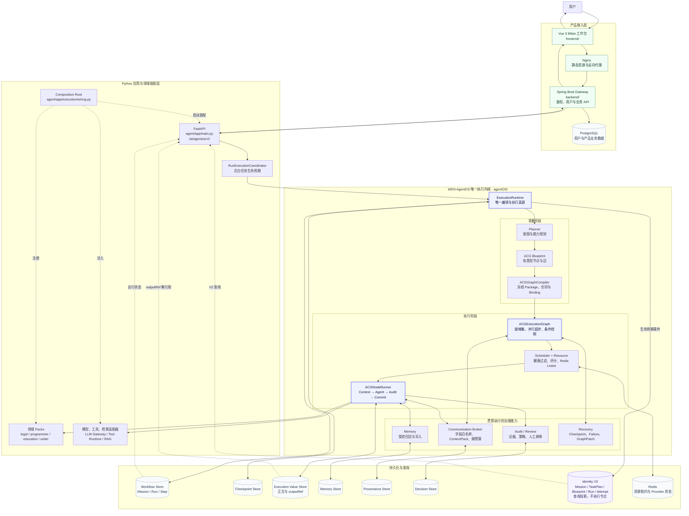

# 知弈 AgentOS 当前架构图

> 视角：一次 ACG 请求从输入、规划、执行到输出与审计的真实主链。
> 原则：`ExecutionRuntime` 是唯一执行真源；Identity V2 只做身份一致性、投影与查询。

## 阅读顺序

1. 用户请求经 Vue、Nginx、Spring Gateway 到达 FastAPI。
2. FastAPI 的 Coordinator 只管理异步任务生命周期，不承担图执行语义。
3. 唯一的 `ExecutionRuntime` 创建或读取 Mission/Run，调用 Planner 形成 Blueprint。
4. Compiler 将 Blueprint 冻结为可执行 Package；ExecutionGraph 决定就绪集与控制流。
5. Scheduler 分配资源和租约，NodeRunner 装配最小 ContextPack、调用 Agent、审计并提交引用。
6. Workflow、Checkpoint、正文、Memory、Provenance、Decision 分开持久化。
7. Identity V2 消费生命周期事件并形成稳定查询投影，但绝不调度或执行节点。
8. 前端查询 Run、图、Trace、血缘和 outputRef，形成最终可视化闭环。

## 不能混淆的边界

- `frontend/`：展示和交互，不推断运行真相。
- `backend/`：产品网关、鉴权和业务数据，不执行 ACG。
- `agent/`：FastAPI 应用、依赖装配和领域 Pack，不应复制内核算法。
- `agentOS/`：规划、调度、图执行、通信、记忆、审计与恢复的唯一核心。
- `agentOS/src/runtime/v2/`：身份生命周期和查询投影，不是 V2 执行器。
- `agentOS/drafts/legacy_execution/`：历史参考，不属于生产调用链。
