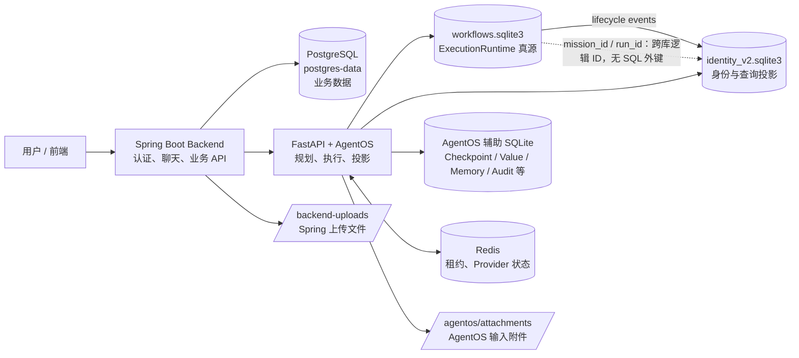
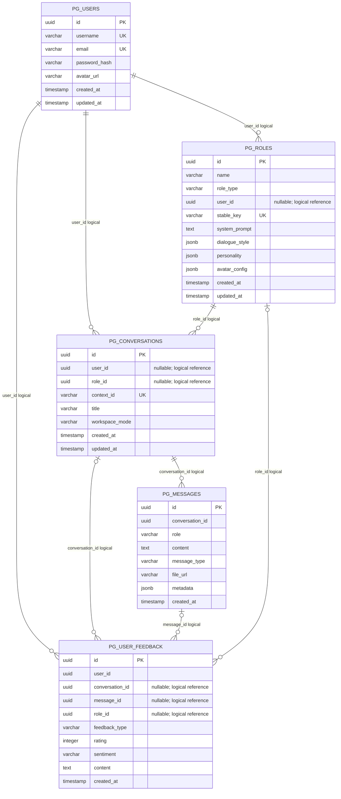
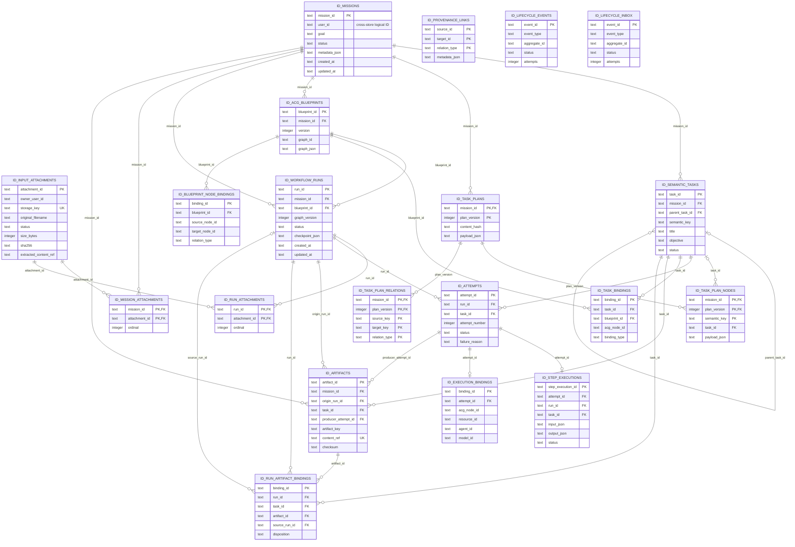
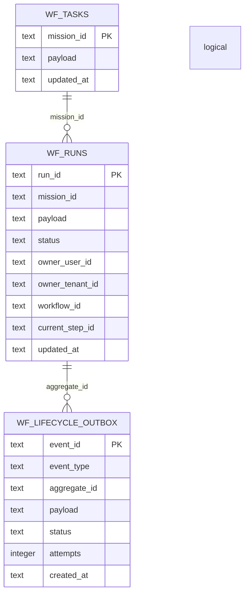

# Kinlin 当前数据存储与 E-R 图

> 基于当前 `compose.yaml`、Spring Boot Flyway 迁移、JPA 实体，以及 AgentOS 的 SQLite Store 实现整理。
> 这是“代码定义的现状模型”；生产数据实际位于 Docker named volume，不是仓库根目录。

## 1. 存储边界总览

当前有两个主要业务边界：

- Spring Boot 业务库：PostgreSQL，保存用户、角色、对话、消息和反馈。
- AgentOS 执行库：多个 SQLite 文件，保存 Mission、Run、TaskPlan、ACG、Attempt、成果引用及恢复/审计数据。

Redis、上传目录和附件目录不是关系数据库，不能完整地表示为传统 E-R 表。

## 2. Spring Boot / PostgreSQL 业务库

注意：这些关系目前主要由应用代码维护。Flyway SQL 只建立了主键、唯一约束和索引，没有为 `user_id`、`role_id`、`conversation_id` 等建立完整的 PostgreSQL `FOREIGN KEY`。

## 3. AgentOS Identity V2 / `identity_v2.sqlite3`

Identity V2 是查询投影和身份一致性边界，不是实际调度节点的执行真源。

以下三类表保留在图中，但它们是事件/图谱式的 ID 记录，不具备完整的 SQL 外键关系：

- `provenance_links`：任意 source/target 引用的血缘边。
- `lifecycle_projection_events`：投影事件及失败重试状态。
- `lifecycle_inbox`：Identity 投影消费幂等记录。

## 4. AgentOS Workflow Store / `workflows.sqlite3`

`WF_RUNS` 是执行运行时的权威记录；`ID_WORKFLOW_RUNS` 是同一 `run_id` 的身份/查询投影。两张表位于不同 SQLite 文件，没有数据库级外键。

## 5. 辅助 SQLite 存储

```mermaid
erDiagram
    EXT_RUN_REF {
        text run_id PK
        text note "logical reference to workflows.sqlite3 / identity_v2.sqlite3"
    }

    CHECKPOINTS {
        text thread_id PK
        text checkpoint_id PK
        text state_json
        integer version
        text created_at
    }

    EXECUTION_VALUES {
        text reference PK
        text run_id
        text step_id
        text kind
        text payload_json
        real created_at
    }

    NODE_EXECUTIONS {
        text operation_id PK
        text run_id
        text payload_json
        text phase
    }

    NODE_COMMITS {
        text commit_id PK
        text run_id
        text payload_json
        text stage
    }

    PROVENANCE_EVENTS {
        text run_id PK
        text event_id PK
        text event_json
    }

    AUDIT_DECISIONS {
        text decision_id PK
        text run_id
        text step_id
        text decision_json
        text decision_hash
    }

    COMMUNICATION_MESSAGES {
        text message_id PK
        text run_id
        text producer_step_id
        text consumer_step_id
        text artifact_ref
        text status
    }

    BLACKBOARD_ENTRIES {
        text run_id PK
        text partition_id PK
        text entry_key PK
        integer version PK
        text artifact_ref
    }

    CONTENT_MANIFESTS {
        text manifest_id PK
        text owner_type
        text owner_id
        text kind
        text checksum
        integer sealed
    }

    CONTENT_FRAGMENTS {
        text manifest_id PK, FK
        integer sequence PK
        text fragment_id UK
        text checksum
        blob content
    }

    EXT_RUN_REF ||--o{ CHECKPOINTS : "thread_id = run_id logical"
    EXT_RUN_REF ||--o{ EXECUTION_VALUES : "run_id logical"
    EXT_RUN_REF ||--o{ NODE_EXECUTIONS : "run_id logical"
    EXT_RUN_REF ||--o{ NODE_COMMITS : "run_id logical"
    EXT_RUN_REF ||--o{ PROVENANCE_EVENTS : "run_id logical"
    EXT_RUN_REF ||--o{ AUDIT_DECISIONS : "run_id logical"
    EXT_RUN_REF ||--o{ COMMUNICATION_MESSAGES : "run_id logical"
    EXT_RUN_REF ||--o{ BLACKBOARD_ENTRIES : "run_id logical"
    CONTENT_MANIFESTS ||--o{ CONTENT_FRAGMENTS : manifest_id
```

当前辅助文件及用途：

| 文件 | 主要表 | 用途 |
|---|---|---|
| `langgraph_checkpoints.sqlite3` | `acg_execution_checkpoints` | 重启恢复的 checkpoint |
| `execution_values.sqlite3` | `execution_values`、`acg_node_executions`、`acg_node_commits` | 输出正文、ContextPack、图补丁和提交状态 |
| `content_manifests.sqlite3` | `content_manifests`、`content_fragments` | 分片内容正文及校验和 |
| `execution_memory.sqlite3` | `execution_memory` | 通过准入的执行记忆 JSON |
| `provenance.sqlite3` | `acg_provenance_events` | 血缘事件及哈希链 |
| `audit_decisions.sqlite3` | `acg_audit_decisions` | 审计/审核决定 |
| `communication.sqlite3` | `communication_messages`、`blackboard_entries` | 可靠通信和黑板引用 |
| `resources.sqlite3` | `resources`、`resource_credentials`、`resource_auth_nonces` | Agent/模型资源目录和凭据 |
| `resource_health.sqlite3` | `resource_health`、`resource_health_events` | 资源健康状态历史 |
| `evolution.sqlite3` | `evolution_policy_versions`、`evolution_policy_state`、proposal/trajectory/evaluation 表 | 演化策略版本和提案 |

其中大部分生产路径在 `/app/data/agentos/`。当前 `AGENTOS_RESOURCE_HEALTH_DB` 和 `AGENTOS_COMMUNICATION_DB` 没有在 Compose 中显式设置，代码默认使用相对路径；容器 `WORKDIR` 为 `/app`，因此它们实际可能落在 `/app/data/` 下，而不是 `/app/data/agentos/`。这是当前配置中值得后续统一的路径问题。

## 6. 阅读这张图时最重要的结论

1. 用户/聊天数据和 AgentOS Mission/Run 数据分属 PostgreSQL 与 SQLite，不能把它们当作同一数据库里的外键关系。
2. `workflows.sqlite3.runs` 是运行时执行真源；`identity_v2.sqlite3.workflow_runs_v2` 是查询投影。
3. AgentOS 将 checkpoint、正文、记忆、血缘、审核决定和通信拆成独立存储，很多表只保存 `run_id`/`step_id`/引用，不保存大段正文。
4. `artifact.content_ref`、`input_attachments.storage_key` 和消息 `file_url` 指向内容/文件存储，不等于数据库表中的正文。
5. `TraceStore` 当前是进程内存结构，Trace 会随 Runtime Run 记录/投影链路保存或传递，不是一个独立的 `trace.sqlite3` 表。
