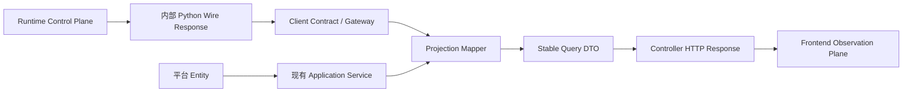

# 知弈 AgentOS N1.2 Query Projection Architecture Migration Plan

日期：2026-10-01。源码 HEAD：`eb3f3c1313e8637b7b188ccb38c2341639ce04f0`。

状态：审计与设计完成，**尚未实施迁移**。本轮仅生成本文；不改代码/API/Python Runtime/ACG Kernel/依赖/数据库，不提交。已有未跟踪的 [审计文档](N1.2-query-projection-audit.md) 保留。本计划比前份 GET 审计补充 POST 查询、Python-only AgentOS GET 和通用代理实际路由面，并采用本轮指定的四阶段顺序。

## 1. 当前问题与审计结论

审计追踪 Java Controller → Service/Gateway → Client Contract → HTTP Implementation → Python API → Query/Domain Model。结论是：当前 transport ownership 已收敛，但成功查询响应没有统一、递归、白名单式的公共投影边界。

| 问题 | 确认的源码事实 | 风险 |
|---|---|---|
| Entity 直接返回 | User/Role/Conversation/Message/UserFeedback 经 Controller 序列化；Conversation detail 外层 Map 内仍有 Entity | C |
| 安全字段 | `User.passwordHash` 无 JsonIgnore，UserService 创建/改密写入哈希；两个 User GET 可返回 Entity | C，Phase 1 首项；静态可达，未取线上数据 |
| Map 暴露 | 所有显式 AgentOS JSON GET 返回 Map；KG、Emotion、RoleFusion 等动态返回；DH DTO.data、RAG sources 仍嵌套 Map | B；若包含内部模型则 C |
| Python domain dump | MissionDetail 嵌入 Mission、SemanticTask、AcgBlueprint、WorkflowRun；MissionRunHistory 和 RunExecutionTree 全量 dump | C |
| Runtime state | project_run.executionState 包含 binding、调度决策、checkpoint 引用、controlFrames 等；usage 含 scheduler | C |
| Kernel → UI contract | 前端 WorkflowExecutionState、ExecutionBinding 类型；Timeline 显示 checkpoint；review panel 读 executionState.reviewPayload；acg API 用 binding 生成展示模型 | C；删字段必须同步切换消费者 |
| 通用代理 | `/ai/**` 成功响应 byte[] 透传；safeUpstreamPath 约束路径安全，头白名单不是 route/response projection 白名单 | B/C；不能按 byte[] 自动豁免 JSON |
| SSE | RuntimeEvent 全量 dump → AiSseGatewayService → ServerSentEvent<String> | C，Phase 4 与 N2 协同；本轮不动 |

风险评级：A = 当前 typed、有限公共响应；B = 未稳定的动态 schema 或 wire/service 类型耦合，需投影；C = Entity 或明确的控制面数据可达；A* = 精确二进制传输例外。C 不代表所有字段都有机密数据，也不代表已观测生产泄漏。

### 不夸大暴露范围

- 显式 Java GET 无直接 Java TaskPlan/ACGBlueprint/CompiledACGPackage/BindingManifest 类型；Python JSON 可以在没有 Java import 的情况下透传这些内核相关信息。
- MissionDetail 没有独立 TaskPlan 字段；workspace 从 TaskPlan 生成依赖/任务展示。禁止把展示关系或 graphVersion 本身判为执行权威。
- MissionDetail/execution-tree 的 AcgBlueprint 是完整领域对象；graph 直接复制 nodes/edges。CompiledPackageIdentity 是 package 身份摘要，不是完整编译包。完整 CompiledACGPackage/BindingManifest 正文未在显式 Java GET 确认。
- checkpoint GET 只返回 id/version/canResume，不是完整快照；但 WorkflowRun.checkpoint 可由 Mission history/tree 嵌套模型到达。
- graphPatchRefs/sourcePatchId 可见；未确认显式 GET 返回完整 GraphPatch 正文。调度决策和统计可见，不等于完整 scheduler 内存快照。
- Artifact manifest 无固定 internalPath 字段；开放 metadata 仍构成透传风险。Attachment 已排除 storage_key 与 owner 字段，不能误报已直接泄漏这些字段。
- LoginResponse 现为 token/userId/username/message，未嵌 User；User 写接口会返回 User，后续防 Entity 回归守卫仍要覆盖它们。

### 审计覆盖与局限

67 个 Java 显式 GET handler + 1 个含 GET 的通用代理；另列 9 个 POST 查询/分析/生成接口和 1 个 binary render。Python AgentOS router 有 38 个 GET，27 个具有显式 Java route、11 个仅上游定义；其他以 `/ai` 挂载的 router 有 32 个 GET 声明（含条件/测试路由），并登记其 69 个 POST 响应候选，区分计算/生成与 command。附录逐项列出，重叠端点不相加作为独立公共 API 数量。

Java 清单路径是源码 mapping，不额外拼部署 context path。Python 附录是静态注册候选，条件 include_router、认证、资源 owner 检查和环境开关决定运行时可达性；未启动服务，不能宣称所有候选都可被当前用户调用。未限制 method 的映射、组合注解、同路由匹配优先级将在实施时用 HandlerMapping/运行时路由表验证。Actuator 不在 controller/ 清单内。

POST `/chat/text`、`/voice/chat`、登录/注册、创建/写入/审核/恢复/上传/训练等是 command，不误标为 Query；KG build 会改图，亦非查询。它们的响应类型仍受最终公共响应守卫约束，迁移只变表示，不重写业务。POST `/voice/tts` 是 binary render 单列传输例外，两个显式 POST SSE 在 Phase 4 单列。

## 2. 查询边界模型



Runtime 决定计划、执行、绑定、调度、checkpoint、恢复、图补丁。Projection 只表达用户可观察的任务、运行进度、显示图、产物、审核状态、消费统计和可见诊断。两个平面可独立演进，但共享公共身份 id；Projection 不成为第二份执行状态权威，不允许反向恢复或驱动调度。

冻结例外继续保留：纯 AgentOS gateway 查询由 Controller 直连 AgentOsClient 契约，SSE 唯一 opener 是 AiSseGatewayService，不新增空 Application Service。Mapper 独立承担真实字段映射；跨查询编排、授权组合或事务需要时才加入有实际职责的 Query Service。

成功响应经 Mapper，错误仍走 N1.1/既有平台错误 owner；Controller 只参数绑定、身份提取、委托与 HTTP 状态处理。`_httpStatus` 不进入 DTO；不在 Mapper 读 HTTP、鉴权、开网络、查库、写缓存或执行 Runtime 动作。

## 3. Projection 架构

建议包结构（仅设计）：

```text
projection/
├── mission/      dto + MissionProjectionMapper
├── run/          dto + RunProjectionMapper + ReviewProjectionMapper
├── graph/        dto + GraphProjectionMapper
├── artifact/     dto + ArtifactProjectionMapper
├── observation/  dto + ObservationProjectionMapper
├── resource/     dto + ResourceProjectionMapper
└── common/       PageQuery<T>, CursorPageQuery<T>, QueryError, 公共值类型
```

平台 DTO/Mapper 加入 `projection/user`、`role`、`conversation`、`message`、`feedback`、`platform`，不将 User/Role 塞进 common。common 不持有 DTO registry、任意 Map、Object 或 Runtime 实例。

内部 wire 类型放 client 自有 wire 包，与公共 DTO 分离。公共 Query DTO 不继承/包装 wire、Entity 或内核类型；不能把 Python 全模型机械复制为 Java DTO。初期 Mapper 可以读取现有内部 Map，公共输出严格 typed；之后 typed wire 演进只影响适配器。允许内部 transport 用 Jackson/Map，但不许进入公共 DTO 的递归字段闭包。

白名单原则为“显式构造新 DTO”，不采用 copyProperties、ObjectMapper.convertValue 到公共 DTO 后保留未知字段、序列化原模型再删黑名单字段。未知上游字段默认忽略；必需字段缺失/类型错走明确契约错误，不默认造成功数据。

状态/时间/enum 映射定义 unknown 策略；不得臆造 completed/healthy/canResume。时间以明确 ISO 8601/时区规则表达；已有字符串格式变更须纳入兼容表。分页、过滤、cursor、null/空数组语义保持单独契约。

## 4. DTO 设计

以下为目标字段草案，列表都是 typed List，子对象都是公共 Projection DTO。保留字段以已有授权可见性为上限，不自动扩张权限。

| 域 / DTO | 公共字段 | 内部数据处理 |
|---|---|---|
| common.PageQuery<T> | items: List<T>、total: long、page/pageSize: int | T 必须在公共允许类型闭包；禁 Page<Entity> |
| common.CursorPageQuery<T> | items、nextCursor: String?、total: Long? | cursor 视为 opaque，不输出内部存储位置 |
| user.CurrentUserQuery / PublicUserQuery | UUID id、username、avatarUrl；本人另有 email、时间 | passwordHash 永不投影；他人不复用本人 DTO |
| role.RoleSummary/DetailQuery | id、name、description、roleType、stableKey、typed AvatarStyleQuery；详情可含 typed personality/dialogueStyle | systemPrompt 仅经已有 owner/edit 权限与用途确认；不开放 userId/任意配置 Map；角色提示不是一概秘密 |
| mission.MissionSummaryQuery | missionId、title、description、status、latestRunId/status、runCount、createdAt/updatedAt | 不透传 Mission.metadata/userId/tenant |
| mission.MissionDetailQuery | MissionSummaryQuery、goal、List<TaskSummaryQuery>、List<RunSummaryQuery>、List<GraphSummaryQuery> | 禁 MissionDetail/TaskPlan/AcgBlueprint/WorkflowRun 本体；constraints 改 List<DisplayConstraintQuery> |
| mission.MissionWorkspaceQuery | mission、activeRun、runs、List<WorkspaceEntryQuery>、GraphQuery、List<DiagnosticQuery>、List<AttachmentQuery> | activeGraph 原始 dict 与 entries.metadata/details 改 typed；生成文本中的 Mission metadata 亦需公共摘要替换 |
| run.RunSummaryQuery | runId/missionId、title、domain/workflowId、公开 source、status/lifecycle、runtimeRevision、时间 | 不存 executionState，summary=true/false 明确各目标形状 |
| run.RunDetailQuery | summary、RunProgressQuery、List<StepSummaryQuery>、List<OutputReferenceQuery>、RunLineageQuery、ReviewStateQuery、RecoveryAvailabilityQuery | 从内部状态只选观察事实；删 bindingHistory/requirements、schedulingDecisions、control/loop/debate 原结构 |
| run.RunProgressQuery | currentStepId、List<String> active/completed/skippedStepIds | 用户进度事实不是执行器状态对象 |
| run.StepSummaryQuery | stepId、name、status、attempt/retryCount、reviewRequired、outputRef/summary、开始结束时间 | 不投影原 step.input/output 或资源 binding |
| run.RunLineageQuery | parentRunId/sourceRunId、supersedesRunId/supersededByRunId、公开 rerunReason | sourcePatchId/patch internals 排除 |
| run.ReviewStateQuery / ReviewItemQuery | 等待审核状态、公开 subject/step、reasonCode、iteration、是否 accepted；记录 id/decision/reviewer/comment/time | 明确支持 WorkflowReviewPanel 现有展示；votes/quorum 若必要用 typed 摘要，禁 raw reviewPayload、operationId/traceEventId |
| run.RecoveryAvailabilityQuery | runId、canResume、公开恢复提示 | 不暴露 checkpointId/version/正文；canResume 从上游授权结果读取，不自行推断调度 |
| run.RunExecutionTreeQuery | RunSummaryQuery、List<TaskExecutionQuery>、List<AttemptSummaryQuery>、产物关联 id | ExecutionBinding、package、lease、nodeExecutions、StepExecution input/output 不可达 |
| graph.GraphQuery | graphId/version、List<GraphNodeQuery>、List<GraphEdgeQuery> | 不嵌 ACGBlueprint/TaskPlan、原 policy/config/执行条件、graphPatchRefs |
| graph.GraphNodeQuery / EdgeQuery | nodeId、taskId、name/label、公共 nodeType/status；edgeId/sourceId/targetId、显示关系类型 | task↔node 对应是纯显示关联；不提供 ExecutionBinding 或编译语义 |
| artifact.ArtifactSummary/DetailQuery | artifactId/manifestId、name/type/mediaType、checksum/byteLength/fragmentCount、验证/封存状态、时间、生产 task/run id、当前/复用显示状态 | Manifest/Artifact/RunArtifactBinding 合并后显式选字段；统一 identity/fallback；删 owner、chunkingVersion、内部路径、metadata |
| artifact.FragmentQuery / ArtifactFragmentPageQuery | fragmentId、sequence、content: String、checksum、verificationStatus、typed EvidenceReferenceQuery、nextCursor | 不丢正文或校验；sourceRefs/constraintRefs 转授权公共引用 |
| artifact.OutputContentQuery | runId/outputRef、mediaType、text: String?、List<PublicOutputSectionQuery> 或合法下载引用 | 原 content 任意 dict 必须按产物种类适配，不包 Object/JsonNode；结构化种类暂未定义则显式契约不支持，不能静默截断或 JSON stringify 逃避守卫 |
| artifact.AttachmentQuery | attachmentId、显示文件名、mediaType、byteLength、时间/公开状态 | 延续 owner/storage_key 排除 |
| observation.TraceItemQuery | eventId、公共 eventType、stepId、time、message、typed TraceDetailQuery | 有限事件详情类型；禁 raw payload/开放 metadata。未知事件保留通用公开摘要，不透传未知 body |
| observation.MemoryObservationQuery | kind、stepId、retrievalMode、budget、List<VisibleMemoryReferenceQuery>、公开 fallbackReason、time | 原 payload 展开改显式分支 DTO；不输出完整 memory/context 内容 |
| observation.ProvenanceQuery | runId、integrityStatus、List<ProvenanceItemQuery>；公开产物/任务/Run/evidence 关系 | 不返回 ledger 原 events、hash chain、内部交互配置；内容 checksum 仍可保留 |
| observation.RunUsageQuery / ModelCallUsageQuery | typed TokenUsageQuery、公开 model/provider、latency、cost、finishReason、contextPressure | 删 scheduler 与 checkpointCount；capability 改有限 PublicModelCapabilityQuery，不包任意原 profile |
| observation.ContextPackSummaryQuery | stepId、opaque ref、available、公开目标、字段/来源计数、token 指标、contractStatus | 不投影 data/sourceData 正文；dataKeys/sourceDataKeys 是否展示按敏感字段策略确认 |
| observation.RunHistoryConfigQuery | 公开 taskGoal/userIntent、reviewMode、pluginIds、typed PlanningDisplayConfig、typed MaterialReferenceQuery | input/pluginData/capabilityProfile 不整体返回；历史重开必需字段逐项映射 |
| resource.ResourceSummaryQuery | resourceId/type、公开名称/能力、声明状态、实际健康、observedAt、typed PublicResourceMetrics | executionEndpoint、ownerScope、调度 capacity、开放 labels/metadata/metrics 不输出；能力声明不等于执行验证 |
| platform.*Query | KG node/edge/stat/search result、RagSourceQuery、EmotionScoreQuery、RoleWeightQuery、DigitalHumanQuery 等固定 DTO | KG/DH/Emotion/RoleFusion/RAG 动态字段逐类投影，保留原 success/data 包装语义用 typed envelope |

公共 JSON DTO 禁止任何 Map 包装（含 scalar Map），即使前份审计允许有限 scalar map，本轮采用更严格的用户要求：动态键改为 typed List<KeyValueQuery> 或领域列表，且不能借 KeyValueQuery.value:Object 重建任意 JSON。

User、Role、Graph 等 DTO 不直接引用内部 enum；用公共 enum/固定字符串契约映射。Projection 类名带 Query 不构成安全证明，必须检查深层序列化输出。

## 5. Migration 顺序与阶段出口

本轮停止于计划。下一轮获得实施指令后每 Phase 拆成可审查小批，不能一次性改全仓。

### Phase 1：高风险安全边界

顺序：User → Role → Mission Detail/mission history → Run Detail/execution-tree。优先 passwordHash 与 Entity 响应；创建稳定 DTO/Mapper 并为新路由上守卫。Conversation/Message/Feedback 的剩余 Entity 作为此安全阶段配套批次清理；写响应的 Entity 禁止规则一并登记，不改变命令处理。

任务输出：Current/PublicUserQuery、RoleSummary/Detail/ContextQuery、MissionDetailQuery、RunDetailQuery、RunExecutionTreeQuery、ReviewStateQuery。前端 reviewPayload/outputRefs/lineage 消费转换是此阶段必要契约工作，不能只删除 executionState。

出口：新增 public DTO 中无 Entity/Runtime 对象，passwordHash 序列化测试与跨用户/租户可见性验证通过；对每个剩余 C 风险登记尚未封闭的入口。`/ai/**` 尚未处理期间，不能声称风险彻底清除。

### Phase 2：Workbench 核心展示

顺序：Mission list/workspace → Run Summary 与历史重开 → Graph → Artifact/material/attachment/fragment/output/download → Resource catalog。资源目录显式路由必须在此阶段投影；内部注册/心跳命令不改变。

任务输出：公共显示图、typed WorkspaceEntry、Artifact identity/fallback 统一模型、typed 产物正文适配、恢复能力显示。保留引用、任务身份、图版本、revision、分页过滤与内容完整性。

出口：Workbench/历史页面/图编辑器展示可用；公开 DTO 不含 Blueprint/TaskPlan/policy/config；fragment cursor、checksum、download bytes/头兼容验证通过；资源目录不含 executionEndpoint。高级审计页尚未迁移时标明剩余状态。

### Phase 3：高级观察

Trace → Memory/Context Pack → Provenance → Resource Usage/Calls → Identity health；同时完成 KG/RAG/DH/Emotion/RoleFusion 等平台动态查询。数据只来自既有上游观察事实，不增 Runtime 采样/调度逻辑。

任务输出：有限事件 union、有限记忆/来源摘要、token/cost/延迟 typed 统计；checkpoint 历史展示改 RecoveryAvailability，GraphPatch 时间线只保留公共变更摘要（现有数据不足时留空/unknown，不推断执行语义）。

出口：Trace/Inspector/审核历史回归；稳定 JSON Map/Object/JsonNode 例外持续收缩至零（除 Phase 4 旧代理登记）；不得把 _redact 等同于 Projection。

### Phase 4：动态代理与 SSE

为 `/ai/**` 建立 method+route+media type 注册表，每个 JSON 查询路由指向同一投影 adapter；无法定义公共 schema 的内部控制面/管理候选路由从用户查询面移除或独立受控管理入口。未知路径不得以 bytes 无条件透传。头过滤与现有身份传递仍由原 transport/security owner 管理。

SSE 与 N2 Runtime Event Protocol 协同：RuntimeEvent → 明确的 EventProjectionMapper → typed 公共 QueryEvent，再由唯一 AiSseGatewayService/原 transport 输出 SSE；不得新增第二 opener、缓冲任意事件或改变取消/背压/终止行为。SSE 允许 Flux<Event>，不是允许 Flux<RawRuntimeEvent>；原 ServerSentEvent<String> 为有退出条件的迁移例外，最终验证实际 JSON data。

两个显式 POST 流 `/ai/chat/text/stream` 和 `/ai/test/sse` 分别登记 chat 流与测试流，测试模式条件保留。HTTP envelope、event name/id/retry、delta 次序、error event、慢订阅溢出和终止必须有兼容清单。

出口：代理不能绕过 Projection；所有静态候选路由被定义为公共投影、binary、SSE、内部管理或关闭；运行时路由表与清单一致；N2 所需验收通过后才关闭 SSE 例外。至此才能宣称 Control Plane 与 Observation Plane 隔离。

### 兼容性与回滚

每个 endpoint 建“旧 JSON 路径 → 新 typed 字段 → 前端消费者 → 迁移版本/退役条件”表，先配套 DTO 与消费者，再明确契约切换。删除内部字段本来就是行为/shape 演进，不能同时声称旧 shape 完全不变。新版本或协调切换的具体选型在实施批次确定，当前不自行新增 URL。

临时旧 route/字段必须列 owner、退出条件、测试；保留它们时整体隔离目标未完成。回滚以独立提交/特性配置和客户端契约协调处理，不能回滚后悄悄继续暴露 passwordHash。内部 Runtime、数据库、transport timeout/header/error owner 保持冻结。

## 6. Architecture Guard 设计

1. **路由全集**：Spring HandlerMapping 展开 GET/组合注解/含 GET 的 RequestMapping/无 method 限制映射，另显式登记 POST query 与所有 public command 的响应。源码 rg 是辅助，不能替代运行时路由集合；Python router 候选与 proxy allowlist 做差异检查。
2. **禁止 Controller Entity**：检查所有 Controller 返回类型及 body 可达图，包括 ResponseEntity、Mono/Flux、List/Page、泛型、数组、DTO getter/字段。Entity/Repository row/持久化代理不得通过 Map、Object 或 nested DTO 绕过。写响应同样禁止，内部 Service Entity 合法。
3. **禁止 DTO 内核引用**：public projection DTO 闭包不得引用/继承 TaskPlan、ACGBlueprint/AcgBlueprint、CompiledACGPackage、ExecutionBinding、BindingManifest、ExecutionState、GraphPatch、RuntimeRunRecord 等；wire/input 类型只能存在内部边界。DTO Mapper 类型与 DTO 类型分别检查，Mapper 读取内部 wire 不等于允许输出它。
4. **稳定 JSON 无动态容器**：禁止 Map（含嵌套 Map）、JsonNode、Object、raw generic、不受控 wildcard、@JsonAnyGetter/@JsonAnySetter。允许泛型 PageQuery<T> 但实例化 T 必须受检；不能把内部原 JSON 字符串藏在 payload:String 来绕过。
5. **序列化路径禁止内核结构**：对实际 success/error fixture 验证禁止 executionState、executionBindings/resourceBindings、bindingHistory、scheduler/schedulingDecisions、checkpoint 内部字段、lease/control/package、graphPatchRefs/内部 patch。采用 JSON 路径与事件 variant 检查；用户文本普通词汇不做全局过滤。
6. **binary 精确例外**：Resource/byte[] 只允许在登记的真实 binary route/媒体类型；`/ai/**` JSON body 不豁免。下载错误响应也要测试，防止 body/header 暴露内部路径。包括 GET artifact/files/avatar 与 POST voice/tts。
7. **SSE 精确例外**：允许 Flux<公共 Event> 或其 ResponseEntity/ServerSentEvent 包装；验证 data 的具体 event variant。拒绝原模型/任意 Map/任意 JSON 字符串的通用透传；旧 SSE 例外精确列 route、owner、N2 退出条件。
8. **Mapper 无执行权威**：Projection Mapper 禁 transport/repository/scheduler/kernel 调用、写入与缓存副作用；固定领域投影依赖图，公共 DTO 不依赖 client/gateway/entity/infrastructure；保持冻结 six-controller owner 与唯一 SSE opener。
9. **守卫测试可靠性**：现有 JUnit/Spring/Jackson 反射与序列化 fixture 实现，不引入依赖。已有 Authority symbol 源码扫描不能替代响应闭包；新增正负 fixture 验证 Entity 套 DTO、Map、byte[] JSON、通用代理和 SSE 都会被发现。断言真实执行，不能因 source path 未找到 assumeTrue 跳过关键 gate。

## 7. 测试策略与验收证据

| 层级 | 必须覆盖 | 通过条件 |
|---|---|---|
| 静态/架构 | return/DTO 闭包、路由全集、transport ownership、Mapper 无写入、未知 route | 正负 fixture 能检测绕过；旧例外逐批消除 |
| Mapper | 所有高风险 wire、identity/fallback、summary=true/false、null/unknown、新增字段 | 公共输出白名单完全一致；缺必需字段明确失败 |
| 序列化安全 | passwordHash、多层 binding/checkpoint/scheduler、内部绝对路径、未知 payload | success/error/SSE 都不可达内部数据；合法产物正文不被删 |
| MVC/client contract | HTTP status、N1.1 error、_httpStatus、query 参数、分页与时间 | route owner/过滤/错误语义维持批准的兼容清单 |
| 权限 | 本人/他人/跨租户、artifact/run/evidence owner、管理路由 | Projection 不扩张访问范围；404/拒绝行为符合原授权契约 |
| binary | fragment 全文/checksum/cursor、download/头像/TTS bytes 与头 | 不截断，不暴露本地路径；JSON 代理不套 binary 例外 |
| SSE | typed variants、delta 顺序、overflow、cancel、error、终止、test-mode | 唯一 opener，行为兼容；每种 data 无内部状态 |
| 前端 | Workbench 图/树、Inspector、review、历史重开、Trace/Usage/Provenance、download | 已确认消费者迁移，无运行时报 undefined 依赖；type-check/相关测试通过 |
| 性能 | Run 默认 summary 快路径、workspace/trace 分页、Map 解析载荷预算 | 不因投影加载整个 Runtime；记录基线而非只看功能通过 |
| 集成与 CI | 现有 ArchitectureGuardTest、RouteCompatibility、ContractSerialization、相关 client/controller tests 与必需 CI | 保持 J1.4D 必需 gate；测试不能替代在线/浏览器验收 |

本轮验证：源码静态清单与链接/字段引用核对；文档生成后核对路由计数、重复、链接、空白与工作树。未执行 Maven、Python 测试、Spring 启动、HTTP、DB 或浏览器验收。本轮无实现，故无“迁移通过”的结论。

### 已确认的前端迁移触点

| 消费位置 | 当前读取 | 目标 |
|---|---|---|
| services/api/agentos/types/workflow.ts | WorkflowExecutionState、checkpointId、resourceBindings | RunDetail/Progress/Review/OutputReferenceQuery |
| services/api/agentos/types/identity.ts | executionBinding、blueprint、package 身份 | TaskExecution/AttemptSummaryQuery、GraphQuery |
| services/api/agentos/api/acg.ts | executionBinding/resourceBindings/outputRefs | typed 观察显示事实；不在前端重建执行权威 |
| workbench/runtime/resourceObservation.ts | detail.executionBinding | PublicExecutionObservationQuery（公开 model/provider/usage，禁 binding 记录） |
| components/agentos/WorkflowReviewPanel.vue | executionState.reviewPayload | ReviewStateQuery |
| components/agentos/WorkflowRunPanel.vue | executionState.checkpointId | RecoveryAvailabilityQuery |
| components/agentos/RuntimeAuditTimeline.vue、history/AcgHistoryPanel.vue | checkpoint id/version、graphPatchRefs | 公共恢复/变更摘要；取消内部引用展示 |
| views/ChatView.vue、AcgVisualizationView.vue、workbench/runtime/observation.ts | graphPatchRefs 与 Blueprint 展示 | 独立 GraphQuery 与公共审计事件 |

这些是确认的源码触点，不是完整 UI 使用验收。下一批还要核对表单/角色编辑/用户资料及 all `/ai` 消费者。

## 8. 全量 Endpoint 审计清单

下表字段与任务要求对应：Endpoint / Owner / Current Response / Data Source / Risk Level / Suggested Projection。Owner 列定位 Java handler 或 Python 文件；Java AgentOS 行的固定调用链为 `AgentOsClient → AgentOsGatewayService → agentos_v2.py`，普通 DB 查询没有 Python 跳转。Suggested Projection 是设计名，并非当前实现。

### 8.1 Java GET 与通用 GET 代理

| Endpoint | Owner | Current Response | Data Source | Risk Level | Suggested Projection |
|---|---|---|---|---|---|
| GET `/api/agentos/v2/materials/{manifestId}` | [AgentOsArtifactController.getMaterial](../apps/backend/src/main/java/com/kinlin/ai/controller/AgentOsArtifactController.java#L46) | `ResponseEntity<Map<String, Object>>` | AgentOsClient -> AgentOsGatewayService -> agentos_v2.py -> ContentManifestStore -> ContentManifest | B | MaterialQuery |
| GET `/api/agentos/v2/resources` | [AgentOsArtifactController.getResources](../apps/backend/src/main/java/com/kinlin/ai/controller/AgentOsArtifactController.java#L51) | `ResponseEntity<Map<String, Object>>` | AgentOsClient -> AgentOsGatewayService -> agentos_v2.py -> ResourceService/NodeService profile and snapshot dump | C | ResourceCatalogQuery |
| GET `/api/agentos/v2/runs/{runId}/artifacts` | [AgentOsArtifactController.getArtifacts](../apps/backend/src/main/java/com/kinlin/ai/controller/AgentOsArtifactController.java#L62) | `ResponseEntity<Map<String, Object>>` | AgentOsClient -> AgentOsGatewayService -> agentos_v2.py -> IdentityQuery.artifacts_for_run; fallback ContentManifestStore | C | ArtifactPageQuery |
| GET `/api/agentos/v2/runs/{runId}/artifacts/{manifestId}` | [AgentOsArtifactController.getArtifact](../apps/backend/src/main/java/com/kinlin/ai/controller/AgentOsArtifactController.java#L68) | `ResponseEntity<Map<String, Object>>` | AgentOsClient -> AgentOsGatewayService -> agentos_v2.py -> Artifact + RunArtifactBinding + ContentManifest dump; fallback manifest | C | ArtifactDetailQuery |
| GET `/api/agentos/v2/runs/{runId}/artifacts/{manifestId}/fragments` | [AgentOsArtifactController.getArtifactFragments](../apps/backend/src/main/java/com/kinlin/ai/controller/AgentOsArtifactController.java#L76) | `ResponseEntity<Map<String, Object>>` | AgentOsClient -> AgentOsGatewayService -> agentos_v2.py -> ContentManifestStore.read_page; full fragment refs + content | C | ArtifactFragmentPageQuery |
| GET `/api/agentos/v2/runs/{runId}/artifacts/{manifestId}/download` | [AgentOsArtifactController.downloadArtifact](../apps/backend/src/main/java/com/kinlin/ai/controller/AgentOsArtifactController.java#L90) | `ResponseEntity<byte[]>` | AgentOsClient -> AgentOsGatewayService -> agentos_v2.py -> ContentManifestStore assembled content, binary bytes | A* | Binary (exact route/media type) |
| GET `/api/agentos/v2/runs/{runId}/outputs/{outputRef}` | [AgentOsArtifactController.getOutput](../apps/backend/src/main/java/com/kinlin/ai/controller/AgentOsArtifactController.java#L110) | `ResponseEntity<Map<String, Object>>` | AgentOsClient -> AgentOsGatewayService -> agentos_v2.py -> ExecutionValueStore.get_output; user artifact content | B | OutputContentQuery |
| GET `/api/agentos/v2/runs/{runId}/legacy-outputs` | [AgentOsArtifactController.getLegacyOutputs](../apps/backend/src/main/java/com/kinlin/ai/controller/AgentOsArtifactController.java#L118) | `ResponseEntity<Map<String, Object>>` | AgentOsClient -> AgentOsGatewayService -> agentos_v2.py -> Runtime run steps output, legacy content projection | B | LegacyOutputsQuery |
| GET `/api/agentos/v2/attachments/{attachmentId}` | [AgentOsArtifactController.getAttachment](../apps/backend/src/main/java/com/kinlin/ai/controller/AgentOsArtifactController.java#L132) | `ResponseEntity<Map<String, Object>>` | AgentOsClient -> AgentOsGatewayService -> agentos_v2.py -> AttachmentStore; owner/storage_key excluded | B | AttachmentQuery |
| GET `/api/agentos/v2/runs/{runId}/events` | [AgentOsEventController.streamRunEvents](../apps/backend/src/main/java/com/kinlin/ai/controller/AgentOsEventController.java#L32) | `Mono<ResponseEntity<Flux<ServerSentEvent<String>>>>` | AiSseGatewayService -> RuntimeEventBroker -> RuntimeEvent.model_dump SSE | C/N2 | Public QueryEvent SSE (Phase 4/N2) |
| GET `/api/agentos/v2/missions` | [AgentOsMissionController.listMissions](../apps/backend/src/main/java/com/kinlin/ai/controller/AgentOsMissionController.java#L46) | `ResponseEntity<Map<String, Object>>` | AgentOsClient -> AgentOsGatewayService -> agentos_v2.py -> IdentityQuery MissionListItem + WorkflowStore run summaries | B | PageQuery<MissionSummaryQuery> |
| GET `/api/agentos/v2/missions/{missionId}` | [AgentOsMissionController.getMission](../apps/backend/src/main/java/com/kinlin/ai/controller/AgentOsMissionController.java#L60) | `ResponseEntity<Map<String, Object>>` | AgentOsClient -> AgentOsGatewayService -> agentos_v2.py -> IdentityQuery.get_mission -> MissionDetail dump | C | MissionDetailQuery |
| GET `/api/agentos/v2/missions/{missionId}/runs` | [AgentOsMissionController.getMissionRuns](../apps/backend/src/main/java/com/kinlin/ai/controller/AgentOsMissionController.java#L65) | `ResponseEntity<Map<String, Object>>` | AgentOsClient -> AgentOsGatewayService -> agentos_v2.py -> IdentityQuery.mission_run_history -> WorkflowRun[] dump | C | MissionRunHistoryQuery |
| GET `/api/agentos/v2/missions/{missionId}/workspace` | [AgentOsObservationController.getMissionWorkspace](../apps/backend/src/main/java/com/kinlin/ai/controller/AgentOsObservationController.java#L31) | `ResponseEntity<Map<String, Object>>` | AgentOsClient -> AgentOsGatewayService -> agentos_v2.py -> MissionWorkspaceProjector + Runtime display overlays | C | MissionWorkspaceQuery |
| GET `/api/agentos/v2/identity/health` | [AgentOsObservationController.getIdentityHealth](../apps/backend/src/main/java/com/kinlin/ai/controller/AgentOsObservationController.java#L42) | `ResponseEntity<Map<String, Object>>` | AgentOsClient -> AgentOsGatewayService -> agentos_v2.py -> Identity reconciliation/inbox/outbox health counters | B | IdentityHealthQuery |
| GET `/api/agentos/v2/runs/{runId}/history-config` | [AgentOsObservationController.getHistoryConfig](../apps/backend/src/main/java/com/kinlin/ai/controller/AgentOsObservationController.java#L47) | `ResponseEntity<Map<String, Object>>` | AgentOsClient -> AgentOsGatewayService -> agentos_v2.py -> RuntimeRunRecord.input whitelist display projection | B | RunHistoryConfigQuery |
| GET `/api/agentos/v2/runs/{runId}/graph` | [AgentOsObservationController.getGraph](../apps/backend/src/main/java/com/kinlin/ai/controller/AgentOsObservationController.java#L53) | `ResponseEntity<Map<String, Object>>` | AgentOsClient -> AgentOsGatewayService -> agentos_v2.py -> Identity Blueprint.graph; fallback Runtime acg_blueprint; resourceBindings | C | GraphQuery |
| GET `/api/agentos/v2/runs/{runId}/execution-tree` | [AgentOsObservationController.getExecutionTree](../apps/backend/src/main/java/com/kinlin/ai/controller/AgentOsObservationController.java#L58) | `ResponseEntity<Map<String, Object>>` | AgentOsClient -> AgentOsGatewayService -> agentos_v2.py -> IdentityQuery.run_execution_tree -> RunExecutionTree dump | C | RunExecutionTreeQuery |
| GET `/api/agentos/v2/runs/{runId}/resource-usage` | [AgentOsObservationController.getResourceUsage](../apps/backend/src/main/java/com/kinlin/ai/controller/AgentOsObservationController.java#L64) | `ResponseEntity<Map<String, Object>>` | AgentOsClient -> AgentOsGatewayService -> agentos_v2.py -> Runtime trace model calls + scheduler counters | C | RunUsageQuery |
| GET `/api/agentos/v2/runs/{runId}/resource-usage/calls` | [AgentOsObservationController.getResourceUsageCalls](../apps/backend/src/main/java/com/kinlin/ai/controller/AgentOsObservationController.java#L70) | `ResponseEntity<Map<String, Object>>` | AgentOsClient -> AgentOsGatewayService -> agentos_v2.py -> Runtime trace -> _model_call_projection + cursor | B | CursorPageQuery<ModelCallUsageQuery> |
| GET `/api/agentos/v2/runs/{runId}/trace` | [AgentOsObservationController.getTrace](../apps/backend/src/main/java/com/kinlin/ai/controller/AgentOsObservationController.java#L85) | `ResponseEntity<Map<String, Object>>` | AgentOsClient -> AgentOsGatewayService -> agentos_v2.py -> TraceStore.export_json -> TraceEvent dump + _redact | C | TracePageQuery |
| GET `/api/agentos/v2/runs/{runId}/memory-events` | [AgentOsObservationController.getMemoryEvents](../apps/backend/src/main/java/com/kinlin/ai/controller/AgentOsObservationController.java#L96) | `ResponseEntity<Map<String, Object>>` | AgentOsClient -> AgentOsGatewayService -> agentos_v2.py -> Runtime trace -> selected fields and partial raw payload | C | MemoryObservationPageQuery |
| GET `/api/agentos/v2/runs/{runId}/provenance` | [AgentOsObservationController.getProvenance](../apps/backend/src/main/java/com/kinlin/ai/controller/AgentOsObservationController.java#L102) | `ResponseEntity<Map<String, Object>>` | AgentOsClient -> AgentOsGatewayService -> agentos_v2.py -> ProvenanceStore ledger events; fallback legacy whitelist | C | ProvenanceQuery |
| GET `/api/agentos/v2/runs/{runId}/checkpoints` | [AgentOsObservationController.getCheckpoints](../apps/backend/src/main/java/com/kinlin/ai/controller/AgentOsObservationController.java#L108) | `ResponseEntity<Map<String, Object>>` | AgentOsClient -> AgentOsGatewayService -> agentos_v2.py -> CheckpointStore.version + checkpointId + canResume | C | RecoveryAvailabilityQuery |
| GET `/api/agentos/v2/runs/{runId}/reviews` | [AgentOsReviewController.getReviews](../apps/backend/src/main/java/com/kinlin/ai/controller/AgentOsReviewController.java#L36) | `ResponseEntity<Map<String, Object>>` | AgentOsClient -> AgentOsGatewayService -> agentos_v2.py -> Runtime.list_reviews -> ReviewRecord[] dump | B | ReviewHistoryQuery |
| GET `/api/agentos/v2/runs` | [AgentOsRunController.listRuns](../apps/backend/src/main/java/com/kinlin/ai/controller/AgentOsRunController.java#L46) | `ResponseEntity<Map<String, Object>>` | AgentOsClient -> AgentOsGatewayService -> agentos_v2.py -> WorkflowStore list_run_overviews(summary=true) or list_runs -> project | C | PageQuery<RunSummaryQuery> |
| GET `/api/agentos/v2/runs/{runId}` | [AgentOsRunController.getRun](../apps/backend/src/main/java/com/kinlin/ai/controller/AgentOsRunController.java#L78) | `ResponseEntity<Map<String, Object>>` | AgentOsClient -> AgentOsGatewayService -> agentos_v2.py -> Runtime.get_status_cached -> project_run + identity summary | C | RunDetailQuery |
| GET `/api/alerts/history` | [AlertController.getAlertHistory](../apps/backend/src/main/java/com/kinlin/ai/controller/AlertController.java#L33) | `ResponseEntity<Map<String, List<AlertService.Alert>>>` | AlertService -> in-memory alertHistory | B | AlertHistoryQuery |
| GET `/api/alerts/history/{alertType}` | [AlertController.getAlertHistoryByType](../apps/backend/src/main/java/com/kinlin/ai/controller/AlertController.java#L42) | `ResponseEntity<List<AlertService.Alert>>` | AlertService -> in-memory alertHistory | B | AlertHistoryByTypeQuery |
| GET `/auth/verify` | [AuthController.verifyToken](../apps/backend/src/main/java/com/kinlin/ai/controller/AuthController.java#L110) | `ResponseEntity<Map<String, Object>>` | JwtUtil; Controller-built token verification fields | B | TokenQuery |
| GET `/chat/history/{contextId}` | [ChatController.getHistory](../apps/backend/src/main/java/com/kinlin/ai/controller/ChatController.java#L41) | `ResponseEntity<List<Message>>` | ChatService -> MessageRepository / platform DB | C | List<MessageQuery> |
| GET `/chat/quality/{contextId}` | [ChatQualityController.assessQuality](../apps/backend/src/main/java/com/kinlin/ai/controller/ChatQualityController.java#L28) | `ResponseEntity<Map<String, Object>>` | ChatService + ChatQualityService; DB messages and local score | B | QualityQuery |
| GET `/conversations` | [ConversationController.getUserConversations](../apps/backend/src/main/java/com/kinlin/ai/controller/ConversationController.java#L30) | `ResponseEntity<List<Conversation>>` | ConversationService -> ConversationRepository/MessageRepository; detail may save auto-generated title | C | List<ConversationSummaryQuery> |
| GET `/conversations/{contextId}` | [ConversationController.getConversation](../apps/backend/src/main/java/com/kinlin/ai/controller/ConversationController.java#L47) | `ResponseEntity<Conversation>` | ConversationService -> ConversationRepository/MessageRepository; detail may save auto-generated title | C | ConversationDetailQuery |
| GET `/conversations/{conversationId}/detail` | [ConversationController.getConversationDetail](../apps/backend/src/main/java/com/kinlin/ai/controller/ConversationController.java#L89) | `ResponseEntity<Map<String, Object>>` | ConversationService -> ConversationRepository/MessageRepository; detail may save auto-generated title | C | ConversationDetailQuery |
| GET `/api/digital-human/{roleId}` | [DigitalHumanController.getDigitalHuman](../apps/backend/src/main/java/com/kinlin/ai/controller/DigitalHumanController.java#L87) | `ResponseEntity<DigitalHumanResponse>` | DigitalHumanService -> DigitalHumanClient -> WebClientDigitalHumanClient -> Python digitalhuman.py, Map data | B | DigitalHumanQuery |
| GET `/files/download/{type}/{filename:.+}` | [FileController.downloadFile](../apps/backend/src/main/java/com/kinlin/ai/controller/FileController.java#L56) | `ResponseEntity<Resource>` | FileService -> local file system, FileInfo service model | A* | Binary (exact route/media type) |
| GET `/files` | [FileController.getFileList](../apps/backend/src/main/java/com/kinlin/ai/controller/FileController.java#L101) | `ResponseEntity<List<FileService.FileInfo>>` | FileService -> local file system, FileInfo service model | B | FileListQuery |
| GET `/health` | [HealthController.health](../apps/backend/src/main/java/com/kinlin/ai/controller/HealthController.java#L45) | `ResponseEntity<Map<String, Object>>` | Controller / AiDependencyHealthClient; readiness DB/Redis, dependencies Python probe | B | healthQuery |
| GET `/health/live` | [HealthController.live](../apps/backend/src/main/java/com/kinlin/ai/controller/HealthController.java#L54) | `ResponseEntity<Map<String, Object>>` | Controller / AiDependencyHealthClient; readiness DB/Redis, dependencies Python probe | B | liveQuery |
| GET `/health/ready` | [HealthController.ready](../apps/backend/src/main/java/com/kinlin/ai/controller/HealthController.java#L59) | `ResponseEntity<Map<String, Object>>` | Controller / AiDependencyHealthClient; readiness DB/Redis, dependencies Python probe | B | readyQuery |
| GET `/health/dependencies` | [HealthController.dependencies](../apps/backend/src/main/java/com/kinlin/ai/controller/HealthController.java#L81) | `ResponseEntity<Map<String, Object>>` | Controller / AiDependencyHealthClient; readiness DB/Redis, dependencies Python probe | B | dependenciesQuery |
| GET `/api/knowledge-graph/stats` | [KnowledgeGraphController.getGraphStats](../apps/backend/src/main/java/com/kinlin/ai/controller/KnowledgeGraphController.java#L71) | `ResponseEntity<Map<String, Object>>` | KnowledgeGraphService -> KnowledgeGraphClient -> WebClientKnowledgeGraphClient -> Python knowledgegraph.py success/data | B | GraphStatsQuery |
| GET `/api/knowledge-graph/entity/{entityId}` | [KnowledgeGraphController.getEntityInfo](../apps/backend/src/main/java/com/kinlin/ai/controller/KnowledgeGraphController.java#L80) | `ResponseEntity<Map<String, Object>>` | KnowledgeGraphService -> KnowledgeGraphClient -> WebClientKnowledgeGraphClient -> Python knowledgegraph.py success/data | B | EntityInfoQuery |
| GET `/api/knowledge-graph/graph-data` | [KnowledgeGraphController.getGraphData](../apps/backend/src/main/java/com/kinlin/ai/controller/KnowledgeGraphController.java#L93) | `ResponseEntity<Map<String, Object>>` | KnowledgeGraphService -> KnowledgeGraphClient -> WebClientKnowledgeGraphClient -> Python knowledgegraph.py success/data | B | GraphDataQuery |
| GET `/api/kylin-os/system-info` | [KylinOSController.getSystemInfo](../apps/backend/src/main/java/com/kinlin/ai/controller/KylinOSController.java#L23) | `ResponseEntity<Map<String, Object>>` | KylinOSIntegrationService -> JVM/OS properties and system command probes | B | SystemInfoQuery |
| GET `/api/kylin-os/resources` | [KylinOSController.monitorResources](../apps/backend/src/main/java/com/kinlin/ai/controller/KylinOSController.java#L32) | `ResponseEntity<Map<String, Object>>` | KylinOSIntegrationService -> JVM/OS properties and system command probes | B | ResourcesQuery |
| GET `/api/kylin-os/security` | [KylinOSController.getSecurityStatus](../apps/backend/src/main/java/com/kinlin/ai/controller/KylinOSController.java#L41) | `ResponseEntity<Map<String, Object>>` | KylinOSIntegrationService -> JVM/OS properties and system command probes | B | SecurityStatusQuery |
| GET `/metrics` | [MetricsController.getMetrics](../apps/backend/src/main/java/com/kinlin/ai/controller/MetricsController.java#L28) | `ResponseEntity<Map<String, Object>>` | Micrometer MeterRegistry local metrics | B | MetricsQuery |
| GET `/rag/documents` | [RagController.listDocuments](../apps/backend/src/main/java/com/kinlin/ai/controller/RagController.java#L62) | `ResponseEntity<Map<String, Object>>` | RagService -> RagClient -> WebClientRagClient -> rag.py document list | B | DocumentsQuery |
| GET `/roles/builtin` | [RoleController.getBuiltinRoles](../apps/backend/src/main/java/com/kinlin/ai/controller/RoleController.java#L30) | `ResponseEntity<List<Role>>` | RoleService/RoleSwitchOptimizer -> RoleRepository DB and Spring Cache | C | List<RoleSummaryQuery> |
| GET `/roles/custom` | [RoleController.getCustomRoles](../apps/backend/src/main/java/com/kinlin/ai/controller/RoleController.java#L39) | `ResponseEntity<List<Role>>` | RoleService/RoleSwitchOptimizer -> RoleRepository DB and Spring Cache | C | List<RoleSummaryQuery> |
| GET `/roles/{roleId}` | [RoleController.getRole](../apps/backend/src/main/java/com/kinlin/ai/controller/RoleController.java#L49) | `ResponseEntity<Role>` | RoleService/RoleSwitchOptimizer -> RoleRepository DB and Spring Cache | C | RoleDetailQuery |
| GET `/roles/{roleId}/context` | [RoleController.getRoleContext](../apps/backend/src/main/java/com/kinlin/ai/controller/RoleController.java#L62) | `ResponseEntity<java.util.Map<String, Object>>` | RoleService/RoleSwitchOptimizer -> RoleRepository DB and Spring Cache | B | RoleContextQuery |
| GET `/search/messages` | [SearchController.searchMessages](../apps/backend/src/main/java/com/kinlin/ai/controller/SearchController.java#L28) | `ResponseEntity<List<Message>>` | ChatService/SearchService -> MessageRepository and owned conversation filtering | C | List<MessageQuery> |
| GET `/search/all-messages` | [SearchController.searchAllMessages](../apps/backend/src/main/java/com/kinlin/ai/controller/SearchController.java#L50) | `ResponseEntity<List<Message>>` | ChatService/SearchService -> MessageRepository and owned conversation filtering | C | List<MessageQuery> |
| GET `/statistics/user/{userId}` | [StatisticsController.getUserStatistics](../apps/backend/src/main/java/com/kinlin/ai/controller/StatisticsController.java#L26) | `ResponseEntity<Map<String, Object>>` | StatisticsService -> ConversationRepository/MessageRepository aggregate | B | UserStatisticsQuery |
| GET `/statistics/system` | [StatisticsController.getSystemStatistics](../apps/backend/src/main/java/com/kinlin/ai/controller/StatisticsController.java#L36) | `ResponseEntity<Map<String, Object>>` | StatisticsService -> ConversationRepository/MessageRepository aggregate | B | SystemStatisticsQuery |
| GET `/statistics/user/{userId}/roles` | [StatisticsController.getRoleStatistics](../apps/backend/src/main/java/com/kinlin/ai/controller/StatisticsController.java#L45) | `ResponseEntity<Map<String, Object>>` | StatisticsService -> ConversationRepository/MessageRepository aggregate | B | RoleStatisticsQuery |
| GET `/users/me` | [UserController.getCurrentUser](../apps/backend/src/main/java/com/kinlin/ai/controller/UserController.java#L43) | `ResponseEntity<User>` | UserService -> UserRepository; avatar also FileService local files | C | CurrentUserQuery |
| GET `/users/{userId}` | [UserController.getUser](../apps/backend/src/main/java/com/kinlin/ai/controller/UserController.java#L57) | `ResponseEntity<User>` | UserService -> UserRepository; avatar also FileService local files | C | PublicUserQuery |
| GET `/users/{userId}/avatar` | [UserController.getAvatar](../apps/backend/src/main/java/com/kinlin/ai/controller/UserController.java#L131) | `ResponseEntity<Resource>` | UserService -> UserRepository; avatar also FileService local files | A* | Binary (exact route/media type) |
| GET `/api/feedback/user/{userId}` | [UserFeedbackController.getUserFeedbacks](../apps/backend/src/main/java/com/kinlin/ai/controller/UserFeedbackController.java#L51) | `ResponseEntity<List<UserFeedback>>` | UserFeedbackService -> UserFeedbackRepository, service-defined statistics objects | C | List<FeedbackQuery> |
| GET `/api/feedback/user/{userId}/statistics` | [UserFeedbackController.getUserFeedbackStatistics](../apps/backend/src/main/java/com/kinlin/ai/controller/UserFeedbackController.java#L60) | `ResponseEntity<UserFeedbackService.FeedbackStatistics>` | UserFeedbackService -> UserFeedbackRepository, service-defined statistics objects | B | UserFeedbackStatisticsQuery |
| GET `/api/feedback/statistics` | [UserFeedbackController.getGlobalStatistics](../apps/backend/src/main/java/com/kinlin/ai/controller/UserFeedbackController.java#L72) | `ResponseEntity<UserFeedbackService.GlobalFeedbackStatistics>` | UserFeedbackService -> UserFeedbackRepository, service-defined statistics objects | B | GlobalStatisticsQuery |
| GET `/profile/{userId}` | [UserProfileController.getUserProfile](../apps/backend/src/main/java/com/kinlin/ai/controller/UserProfileController.java#L25) | `ResponseEntity<Map<String, Object>>` | UserProfileService -> users/conversations/messages/roles and local recommendations | B | UserProfileQuery |
| GET `/profile/{userId}/recommendations` | [UserProfileController.getRecommendations](../apps/backend/src/main/java/com/kinlin/ai/controller/UserProfileController.java#L43) | `ResponseEntity<Map<String, Object>>` | UserProfileService -> users/conversations/messages/roles and local recommendations | B | RecommendationsQuery |
| GET `/ai/**` | [AiServiceProxyController.proxy](../apps/backend/src/main/java/com/kinlin/ai/controller/AiServiceProxyController.java#L32) | `ResponseEntity<byte[]>` | AiProxyService.forward -> Python /ai/**, success bytes passthrough | B/C | Route-specific JSON projection; no generic bytes exemption |

### 8.2 POST 查询/分析/生成与二进制渲染

9 query-like computations plus 1 binary render; preserve existing authorization and business effects.

| Endpoint | Owner | Current Response | Data Source | Risk Level | Suggested Projection |
|---|---|---|---|---|---|
| POST `/api/knowledge-graph/search` | KnowledgeGraphController.hybridSearch | `ResponseEntity<Map<String,Object>>` | KnowledgeGraphService -> KnowledgeGraphClient -> WebClientKnowledgeGraphClient -> /api/knowledge-graph/search -> knowledgegraph.py success/data | B | KnowledgeSearchQuery |
| POST `/api/knowledge-graph/reason` | KnowledgeGraphController.reasonWithKnowledgeGraph | `ResponseEntity<Map<String,Object>>` | Same KG chain -> /api/knowledge-graph/reason -> knowledgegraph.py handwritten result | B | KnowledgeReasoningQuery |
| POST `/rag/query` | RagController.query | `ResponseEntity<RagClient.RagQueryResult>` | RagService -> RagClient -> WebClientRagClient -> rag.py /rag/query -> RAGResponse; sources List<Dict> | B | RagAnswerQuery + List<RagSourceQuery> |
| POST `/api/emotion/analyze` | EmotionController.analyzeEmotion | `ResponseEntity<Map<String,Object>>` | EmotionAwareService -> EmotionClient -> WebClientEmotionClient -> /ai/emotion/analyze -> emotion.py fused_emotion dict | B | EmotionAnalysisQuery |
| POST `/api/emotion/response` | EmotionController.generateEmotionAwareResponse | `ResponseEntity<Map<String,Object>>` | Same Emotion chain -> /ai/emotion/response -> emotion.py response dict | B | EmotionAwareReplyQuery |
| POST `/api/role-fusion/fuse` | RoleFusionController.fuseRoles | `ResponseEntity<Map<String,Object>>` | RoleFusionService -> RoleFusionClient -> WebClientRoleFusionClient -> /ai/role-fusion/fuse -> rolefusion.py result dict | B | RoleFusionQuery |
| POST `/api/role-fusion/weights` | RoleFusionController.calculateRoleWeights | `ResponseEntity<Map<String,Object>>` | Same RoleFusion chain -> /ai/role-fusion/weights -> rolefusion.py role_weights result | B | RoleWeightListQuery |
| POST `/recommendations/questions` | RecommendationController.getRecommendations | `ResponseEntity<List<String>>` | RecommendationService local computation; no Python | A | List<String> fixed scalar contract |
| POST `/recommendations/contextual` | RecommendationController.getContextualRecommendations | `ResponseEntity<List<RecommendationItem>>` | RecommendationService local computation; text/reason/targetAction/confidence/scope | A | Existing stable RecommendationItem or RecommendationQuery |
| POST `/voice/tts` | VoiceController.textToSpeech | `ResponseEntity<byte[]>` | VoiceService -> SpeechClient -> WebClientSpeechClient -> /ai/tts audio bytes | A* | Binary audio exact exception |

Explicit POST SSE: `/ai/chat/text/stream`, `/ai/test/sse`; Owner=AiServiceProxyController -> AiSseGatewayService; Current Response=`Mono<ResponseEntity<Flux<ServerSentEvent<String>>>>`; Data Source=Python chat/test stream; Risk=C/Phase 4; Suggested Projection=public ChatEvent/TestEvent. Test stream is conditional.

### 8.3 Python AgentOS GET 上游全集

38 declarations: 27 overlap explicit Java routes; 11 are upstream-only. Generic proxy candidates remain subject to upstream authorization and environment.

| Endpoint | Owner | Current Response | Data Source | Risk Level | Suggested Projection |
|---|---|---|---|---|---|
| GET `/ai/agentos/v2/attachments/{attachment_id}` | [agentos_v2.get_attachment](../apps/agent/app/api/agentos_v2.py#L871) | Python JSON/dict; model specified in Data Source | AttachmentStore; owner/storage_key excluded | B | AttachmentQuery |
| GET `/ai/agentos/v2/materials/{manifest_id}` | [agentos_v2.get_material](../apps/agent/app/api/agentos_v2.py#L900) | Python JSON/dict; model specified in Data Source | ContentManifestStore -> ContentManifest | B | MaterialQuery |
| GET `/ai/agentos/v2/identity/health` | [agentos_v2.get_identity_health](../apps/agent/app/api/agentos_v2.py#L905) | Python JSON/dict; model specified in Data Source | Identity reconciliation/inbox/outbox health counters | B | IdentityHealthQuery |
| GET `/ai/agentos/v2/resources` | [agentos_v2.get_resources](../apps/agent/app/api/agentos_v2.py#L949) | Python JSON/dict; model specified in Data Source | ResourceService/NodeService profile and snapshot dump | C | ResourceCatalogQuery |
| GET `/ai/agentos/v2/nodes` | [agentos_v2.get_nodes](../apps/agent/app/api/agentos_v2.py#L1020) | NodeProfile/NodeSnapshot dump | NodeService profiles/snapshots | C | NodeCatalogQuery |
| GET `/ai/agentos/v2/agents` | [agentos_v2.get_agents](../apps/agent/app/api/agentos_v2.py#L1046) | AgentProfile/AgentSnapshot dump | AgentService profiles/snapshots | C | AgentCatalogQuery |
| GET `/ai/agentos/v2/missions` | [agentos_v2.list_missions](../apps/agent/app/api/agentos_v2.py#L1274) | Python JSON/dict; model specified in Data Source | IdentityQuery MissionListItem + WorkflowStore run summaries | B | PageQuery<MissionSummaryQuery> |
| GET `/ai/agentos/v2/missions/{mission_id}` | [agentos_v2.get_mission](../apps/agent/app/api/agentos_v2.py#L1325) | Python JSON/dict; model specified in Data Source | IdentityQuery.get_mission -> MissionDetail dump | C | MissionDetailQuery |
| GET `/ai/agentos/v2/missions/{mission_id}/runs` | [agentos_v2.get_mission_runs](../apps/agent/app/api/agentos_v2.py#L1329) | Python JSON/dict; model specified in Data Source | IdentityQuery.mission_run_history -> WorkflowRun[] dump | C | MissionRunHistoryQuery |
| GET `/ai/agentos/v2/missions/{mission_id}/workspace` | [agentos_v2.get_mission_workspace](../apps/agent/app/api/agentos_v2.py#L1335) | Python JSON/dict; model specified in Data Source | MissionWorkspaceProjector + Runtime display overlays | C | MissionWorkspaceQuery |
| GET `/ai/agentos/v2/missions/{mission_id}/workspace/files` | [agentos_v2.list_workspace_files](../apps/agent/app/api/agentos_v2.py#L1652) | workspaceRoot/path/entries dict | Local Runtime filesystem dispatch | C | WorkspaceFilePageQuery; omit internal root |
| GET `/ai/agentos/v2/runs/{run_id}/execution-tree` | [agentos_v2.get_execution_tree](../apps/agent/app/api/agentos_v2.py#L1756) | Python JSON/dict; model specified in Data Source | IdentityQuery.run_execution_tree -> RunExecutionTree dump | C | RunExecutionTreeQuery |
| GET `/ai/agentos/v2/runs/{run_id}/attempts` | [agentos_v2.get_attempt_history](../apps/agent/app/api/agentos_v2.py#L1764) | AttemptHistory dump | IdentityQuery.attempt_history | C | AttemptHistoryQuery |
| GET `/ai/agentos/v2/attempts/{attempt_id}` | [agentos_v2.get_attempt](../apps/agent/app/api/agentos_v2.py#L1775) | AttemptDetail dump | IdentityQuery.get_attempt; ExecutionBinding/StepExecution | C | AttemptSummaryDetailQuery |
| GET `/ai/agentos/v2/step-executions/{step_execution_id}` | [agentos_v2.get_step_execution](../apps/agent/app/api/agentos_v2.py#L1788) | StepExecutionDetail dump | ExecutionOrigin + provenance_links; domain/execution models | C | StepExecutionObservationQuery |
| GET `/ai/agentos/v2/step-executions/{step_execution_id}/provenance` | [agentos_v2.get_step_execution_provenance](../apps/agent/app/api/agentos_v2.py#L1798) | ExecutionProvenance dump | IdentityQuery.execution_provenance -> ProvenanceLink[] | C | StepProvenanceQuery |
| GET `/ai/agentos/v2/runs` | [agentos_v2.list_runs](../apps/agent/app/api/agentos_v2.py#L1868) | Python JSON/dict; model specified in Data Source | WorkflowStore list_run_overviews(summary=true) or list_runs -> project | C | PageQuery<RunSummaryQuery> |
| GET `/ai/agentos/v2/runs/{run_id}` | [agentos_v2.get_run](../apps/agent/app/api/agentos_v2.py#L1942) | Python JSON/dict; model specified in Data Source | Runtime.get_status_cached -> project_run + identity summary | C | RunDetailQuery |
| GET `/ai/agentos/v2/runs/{run_id}/history-config` | [agentos_v2.get_history_config](../apps/agent/app/api/agentos_v2.py#L1946) | Python JSON/dict; model specified in Data Source | RuntimeRunRecord.input whitelist display projection | B | RunHistoryConfigQuery |
| GET `/ai/agentos/v2/runs/{run_id}/resource-usage` | [agentos_v2.get_resource_usage](../apps/agent/app/api/agentos_v2.py#L1955) | Python JSON/dict; model specified in Data Source | Runtime trace model calls + scheduler counters | C | RunUsageQuery |
| GET `/ai/agentos/v2/runs/{run_id}/resource-usage/calls` | [agentos_v2.get_resource_usage_calls](../apps/agent/app/api/agentos_v2.py#L2046) | Python JSON/dict; model specified in Data Source | Runtime trace -> _model_call_projection + cursor | B | CursorPageQuery<ModelCallUsageQuery> |
| GET `/ai/agentos/v2/runs/{run_id}/graph` | [agentos_v2.get_graph](../apps/agent/app/api/agentos_v2.py#L2067) | Python JSON/dict; model specified in Data Source | Identity Blueprint.graph; fallback Runtime acg_blueprint; resourceBindings | C | GraphQuery |
| GET `/ai/agentos/v2/runs/{run_id}/outputs/{output_ref}` | [agentos_v2.get_output](../apps/agent/app/api/agentos_v2.py#L2099) | Python JSON/dict; model specified in Data Source | ExecutionValueStore.get_output; user artifact content | B | OutputContentQuery |
| GET `/ai/agentos/v2/runs/{run_id}/context-packs` | [agentos_v2.list_context_packs](../apps/agent/app/api/agentos_v2.py#L2124) | Bounded summary dict | ExecutionValueStore metadata; excludes data/sourceData bodies | B | List<ContextPackSummaryQuery> |
| GET `/ai/agentos/v2/runs/{run_id}/artifacts` | [agentos_v2.list_artifacts](../apps/agent/app/api/agentos_v2.py#L2160) | Python JSON/dict; model specified in Data Source | IdentityQuery.artifacts_for_run; fallback ContentManifestStore | C | ArtifactPageQuery |
| GET `/ai/agentos/v2/runs/{run_id}/artifacts/{manifest_id}` | [agentos_v2.get_artifact](../apps/agent/app/api/agentos_v2.py#L2179) | Python JSON/dict; model specified in Data Source | Artifact + RunArtifactBinding + ContentManifest dump; fallback manifest | C | ArtifactDetailQuery |
| GET `/ai/agentos/v2/runs/{run_id}/artifacts/{manifest_id}/fragments` | [agentos_v2.get_artifact_fragments](../apps/agent/app/api/agentos_v2.py#L2193) | Python JSON/dict; model specified in Data Source | ContentManifestStore.read_page; full fragment refs + content | C | ArtifactFragmentPageQuery |
| GET `/ai/agentos/v2/runs/{run_id}/artifacts/{manifest_id}/download` | [agentos_v2.download_artifact](../apps/agent/app/api/agentos_v2.py#L2308) | StreamingResponse binary | ContentManifestStore assembled content, binary bytes | A* | Binary (exact route/media type) |
| GET `/ai/agentos/v2/runs/{run_id}/legacy-outputs` | [agentos_v2.get_legacy_outputs](../apps/agent/app/api/agentos_v2.py#L2319) | Python JSON/dict; model specified in Data Source | Runtime run steps output, legacy content projection | B | LegacyOutputsQuery |
| GET `/ai/agentos/v2/runs/{run_id}/trace` | [agentos_v2.get_trace](../apps/agent/app/api/agentos_v2.py#L2338) | Python JSON/dict; model specified in Data Source | TraceStore.export_json -> TraceEvent dump + _redact | C | TracePageQuery |
| GET `/ai/agentos/v2/runs/{run_id}/events` | [agentos_v2.stream_runtime_events](../apps/agent/app/api/agentos_v2.py#L2345) | StreamingResponse SSE, RuntimeEvent dump | RuntimeEventBroker -> RuntimeEvent.model_dump SSE | C/N2 | Public QueryEvent SSE (Phase 4/N2) |
| GET `/ai/agentos/v2/runs/{run_id}/provenance` | [agentos_v2.get_provenance](../apps/agent/app/api/agentos_v2.py#L2375) | Python JSON/dict; model specified in Data Source | ProvenanceStore ledger events; fallback legacy whitelist | C | ProvenanceQuery |
| GET `/ai/agentos/v2/runs/{run_id}/checkpoints` | [agentos_v2.get_checkpoints](../apps/agent/app/api/agentos_v2.py#L2408) | Python JSON/dict; model specified in Data Source | CheckpointStore.version + checkpointId + canResume | C | RecoveryAvailabilityQuery |
| GET `/ai/agentos/v2/runs/{run_id}/reviews` | [agentos_v2.get_reviews](../apps/agent/app/api/agentos_v2.py#L2423) | Python JSON/dict; model specified in Data Source | Runtime.list_reviews -> ReviewRecord[] dump | B | ReviewHistoryQuery |
| GET `/ai/agentos/v2/runs/{run_id}/scheduling` | [agentos_v2.get_scheduling](../apps/agent/app/api/agentos_v2.py#L2433) | schedulingDecisions dict[] with _redact | Runtime execution_state | C | Internal-only; optional PublicResourceAllocationSummaryQuery |
| GET `/ai/agentos/v2/runs/{run_id}/memory-events` | [agentos_v2.get_memory_events](../apps/agent/app/api/agentos_v2.py#L2439) | Python JSON/dict; model specified in Data Source | Runtime trace -> selected fields and partial raw payload | C | MemoryObservationPageQuery |
| GET `/ai/agentos/v2/evolution/active` | [agentos_v2.get_active_evolution_policy](../apps/agent/app/api/agentos_v2.py#L2467) | policy version model_dump | EvolutionService.store.active | C | Internal control plane, not ordinary user query |
| GET `/ai/agentos/v2/evolution/history` | [agentos_v2.get_evolution_history](../apps/agent/app/api/agentos_v2.py#L2471) | policy version model_dump[] | EvolutionService.store.history | C | Internal control plane; optional PolicyChangeSummaryQuery |

### 8.4 其他已挂载 `/ai` router 的 GET 候选

Static mount candidates only; optional imports and test-mode settings may disable routes. Query-like generation can have internal effects; command rows document ownership, not authorization to rewrite business. Data Source shows return expressions.

| Endpoint | Owner | Current Response | Data Source | Risk Level | Suggested Projection |
|---|---|---|---|---|---|
| GET `/ai/chat/models` | [Python chat.chat_models](../apps/agent/app/api/chat.py#L117); AiServiceProxyController | Handwritten response; no response_model | `await list_system_runtime_models()` | B | ChatModelsQuery |
| GET `/ai/chat/model-capabilities` | [Python chat.chat_model_capabilities](../apps/agent/app/api/chat.py#L123); AiServiceProxyController | Handwritten response; no response_model | `model_capability_summary(model, base_url, '')` | B | ChatModelCapabilitiesQuery |
| GET `/ai/chat/capabilities` | [Python chat.chat_capabilities](../apps/agent/app/api/chat.py#L135); AiServiceProxyController | Handwritten response; no response_model | `{**models, 'toolRuntime': get_chat_tool_runtime().capabilities()}` | B | ChatCapabilitiesQuery |
| GET `/ai/llm/profiles` | [Python llm_admin.list_llm_profiles](../apps/agent/app/api/llm_admin.py#L59); AiServiceProxyController | Handwritten response; no response_model | `_store_payload()` | B | ProviderProfileSummaryQuery (management visibility; current response excludes keys) |
| GET `/ai/test/trace` | [Python sse_test.trace_probe](../apps/agent/app/api/sse_test.py#L37); AiServiceProxyController | Handwritten response; no response_model | `{'trace_id': current_trace_id()}` | B | TraceProbeQuery (test-mode only) |
| GET `/ai/test/sse/cancellations/{request_id}` | [Python sse_test.cancellation_status](../apps/agent/app/api/sse_test.py#L90); AiServiceProxyController | Handwritten response; no response_model | `{'request_id': request_id, 'state': state, 'cancelled': state == 'cancelled'}` | B | CancellationStatusQuery (test-mode only) |
| GET `/ai/digital-human/{role_id}` | [Python digitalhuman.get_digital_human](../apps/agent/app/api/digitalhuman.py#L96); AiServiceProxyController | Handwritten response; no response_model | `{'success': True, 'data': avatar_data}` | B | GetDigitalHumanQuery |
| GET `/ai/digital-human/{role_id}/avatars` | [Python digitalhuman.list_role_avatars](../apps/agent/app/api/digitalhuman.py#L111); AiServiceProxyController | Handwritten response; no response_model | `{'success': True, 'data': avatars, 'count': len(avatars)}` | B | ListRoleAvatarsQuery |
| GET `/ai/digital-human/{role_id}/images` | [Python digitalhuman.list_digital_human_images](../apps/agent/app/api/digitalhuman.py#L138); AiServiceProxyController | Handwritten response; no response_model | `{'success': True, 'data': images, 'count': len(images)}` | B | ListDigitalHumanImagesQuery |
| GET `/ai/digital-human/image/{filename:path}` | [Python digitalhuman.get_digital_human_image](../apps/agent/app/api/digitalhuman.py#L150); AiServiceProxyController | Handwritten response; no response_model | `FileResponse(path=str(image_path), media_type='image/png', headers={'Cache-Control': 'public, max-age=31536000', 'Access-Control-Allow-Origin': '*'})` | A* | Binary exact route/media exception |
| GET `/ai/digital-human/images/all` | [Python digitalhuman.list_all_digital_human_images](../apps/agent/app/api/digitalhuman.py#L190); AiServiceProxyController | Handwritten response; no response_model | `{'success': True, 'data': images, 'count': len(images)}` | B | ListAllDigitalHumanImagesQuery |
| GET `/ai/adaptive-learning/statistics/{role_id}` | [Python adaptivelearning.get_learning_statistics](../apps/agent/app/api/adaptivelearning.py#L102); AiServiceProxyController | Handwritten response; no response_model | `{'success': True, 'data': stats}` | B | GetLearningStatisticsQuery |
| GET `/ai/model-selector/statistics` | [Python modelselector.get_performance_statistics](../apps/agent/app/api/modelselector.py#L110); AiServiceProxyController | Handwritten response; no response_model | `{'success': True, 'data': stats}` | B | GetPerformanceStatisticsQuery |
| GET `/ai/model-selector/current` | [Python modelselector.get_current_model](../apps/agent/app/api/modelselector.py#L142); AiServiceProxyController | Handwritten response; no response_model | `{'success': True, 'data': {'current_model': current.value, 'model_info': model_info}}` | B | GetCurrentModelQuery |
| GET `/ai/model-selector/history` | [Python modelselector.get_switch_history](../apps/agent/app/api/modelselector.py#L160); AiServiceProxyController | Handwritten response; no response_model | `{'success': True, 'data': history}` | B | GetSwitchHistoryQuery |
| GET `/ai/role-style-learning/{role_id}` | [Python rolestylelearning.get_learned_style](../apps/agent/app/api/rolestylelearning.py#L65); AiServiceProxyController | Handwritten response; no response_model | `{'success': True, 'data': learned_style} / {'success': False, 'message': f'角色 {role_id} 尚未学习风格'}` | B | GetLearnedStyleQuery |
| GET `/ai/collaborative-chat/{session_id}` | [Python collaborativechat.get_session_info](../apps/agent/app/api/collaborativechat.py#L122); AiServiceProxyController | Handwritten response; no response_model | `{'success': True, 'data': info}` | B | GetSessionInfoQuery |
| GET `/ai/collaborative-chat/user/{user_id}/sessions` | [Python collaborativechat.get_user_sessions](../apps/agent/app/api/collaborativechat.py#L141); AiServiceProxyController | Handwritten response; no response_model | `{'success': True, 'data': sessions}` | B | GetUserSessionsQuery |
| GET `/ai/kylin-os/system-info` | [Python kylinos.get_system_info](../apps/agent/app/api/kylinos.py#L24); AiServiceProxyController | Handwritten response; no response_model | `{'success': True, 'data': info}` | B | GetSystemInfoQuery |
| GET `/ai/kylin-os/resources` | [Python kylinos.monitor_resources](../apps/agent/app/api/kylinos.py#L37); AiServiceProxyController | Handwritten response; no response_model | `{'success': True, 'data': resources}` | B | MonitorResourcesQuery |
| GET `/ai/kylin-os/security` | [Python kylinos.get_security_status](../apps/agent/app/api/kylinos.py#L50); AiServiceProxyController | Handwritten response; no response_model | `{'success': True, 'data': security}` | B | GetSecurityStatusQuery |
| GET `/ai/communication-optimizer/stats` | [Python communicationoptimizer.get_optimization_stats](../apps/agent/app/api/communicationoptimizer.py#L65); AiServiceProxyController | Handwritten response; no response_model | `{'success': True, 'data': stats}` | B | GetOptimizationStatsQuery |
| GET `/ai/performance-optimizer/system` | [Python performanceoptimizer.optimize_system_performance](../apps/agent/app/api/performanceoptimizer.py#L31); AiServiceProxyController | Handwritten response; no response_model | `{'success': True, 'data': result}` | B | OptimizeSystemPerformanceQuery |
| GET `/ai/federated-models/list` | [Python federatedmodelmanagement.list_federated_models](../apps/agent/app/api/federatedmodelmanagement.py#L56); AiServiceProxyController | Handwritten response; no response_model | `{'success': True, 'data': models}` | B | ListFederatedModelsQuery |
| GET `/ai/federated-models/status` | [Python federatedmodelmanagement.get_optimization_status](../apps/agent/app/api/federatedmodelmanagement.py#L341); AiServiceProxyController | Handwritten response; no response_model | `{'success': True, 'data': {'optimization_status': status, 'model_statistics': model_stats, 'federated_learning_enabled': True, 'last_update': datetime.now().isoformat()}}` | B | GetOptimizationStatusQuery |
| GET `/ai/federated-models/{model_type}/details` | [Python federatedmodelmanagement.get_model_details](../apps/agent/app/api/federatedmodelmanagement.py#L366); AiServiceProxyController | Handwritten response; no response_model | `{'success': True, 'data': {'model_type': model_type, 'model_info': model_info, 'performance_statistics': stats, 'optimization_history': [{'version': 'v2.1', 'date': '2025-12-28', 'improvements': {'accuracy': 0.05}}, {'version': 'v` | B | GetModelDetailsQuery |
| GET `/ai/global-model/download/{client_id}` | [Python federatedglobal.download_model](../apps/agent/app/api/federatedglobal.py#L70); AiServiceProxyController | Handwritten response; no response_model | `{'success': True, 'model': model_info}` | B | DownloadModelQuery; model/parameter body needs separate management contract |
| GET `/ai/global-model/history` | [Python federatedglobal.get_model_history](../apps/agent/app/api/federatedglobal.py#L116); AiServiceProxyController | Handwritten response; no response_model | `{'success': True, 'history': history}` | B | GetModelHistoryQuery; model/parameter body needs separate management contract |
| GET `/ai/global-model/clients` | [Python federatedglobal.get_client_statistics](../apps/agent/app/api/federatedglobal.py#L130); AiServiceProxyController | Handwritten response; no response_model | `{'success': True, 'statistics': stats}` | B | GetClientStatisticsQuery; model/parameter body needs separate management contract |
| GET `/ai/federated-rag/analyze-patterns` | [Python federatedrag.analyze_retrieval_patterns](../apps/agent/app/api/federatedrag.py#L48); AiServiceProxyController | Handwritten response; no response_model | `{'success': True, 'analysis': analysis}` | B | AnalyzeRetrievalPatternsQuery; model/parameter body needs separate management contract |
| GET `/ai/federated-rag/get-params/{client_id}` | [Python federatedrag.get_optimized_params](../apps/agent/app/api/federatedrag.py#L75); AiServiceProxyController | Handwritten response; no response_model | `{'success': True, 'params': params}` | B | GetOptimizedParamsQuery; model/parameter body needs separate management contract |
| GET `/ai/federated-rag/status` | [Python federatedrag.get_optimization_status](../apps/agent/app/api/federatedrag.py#L102); AiServiceProxyController | Handwritten response; no response_model | `{'success': True, 'status': status}` | B | GetOptimizationStatusQuery; model/parameter body needs separate management contract |

### 8.5 已挂载 `/ai` router 的 POST 响应候选全集与分类

Static mount candidates only; optional imports and test-mode settings may disable routes. Query-like generation can have internal effects; command rows document ownership, not authorization to rewrite business. Data Source shows return expressions.

| Endpoint | Owner | Current Response | Data Source | Risk Level | Suggested Projection |
|---|---|---|---|---|---|
| POST `/ai/chat/approvals/{approval_id}` | [Python chat.resolve_chat_approval](../apps/agent/app/api/chat.py#L90); AiServiceProxyController | Handwritten response; no response_model | `{'approvalId': approval_id, 'status': 'resolved', 'decision': request.decision.value}` | B (command response) | Separate Command Response DTO; not ordinary Query |
| POST `/ai/chat/text` | [Python chat.chat_text](../apps/agent/app/api/chat.py#L141); AiServiceProxyController | ChatResponse | `ChatResponse(text=response.text, contextId=session_id, confidence=0.95, tokens_used=int(usage.get('total_tokens') or 0), model_info=response.model, sources=[source.public_dict() for source in response.sources], metadata={**respons` | B (command response) | Separate Command Response DTO; not ordinary Query |
| POST `/ai/chat/text/stream` | [Python chat.chat_text_stream](../apps/agent/app/api/chat.py#L296); AiServiceProxyController | Handwritten response; no response_model | `StreamingResponse(event_stream(), media_type='text/event-stream', headers={'Cache-Control': 'no-cache, no-transform', 'X-Accel-Buffering': 'no'})` | C/Phase 4 | Public SSE Event; preserve opener/business |
| POST `/ai/chat/text/cancel` | [Python chat.chat_text_cancel](../apps/agent/app/api/chat.py#L335); AiServiceProxyController | Handwritten response; no response_model | `{'requestId': request.request_id, 'cancelled': cancelled}` | B (command response) | Separate Command Response DTO; not ordinary Query |
| POST `/ai/chat/voice` | [Python chat.chat_voice](../apps/agent/app/api/chat.py#L412); AiServiceProxyController | Handwritten response; no response_model | `{'text': chat_response['text'], 'confidence': chat_response['confidence'], 'recognized_text': response['text']}` | B (command response) | Separate Command Response DTO; not ordinary Query |
| POST `/ai/tts` | [Python tts.text_to_speech](../apps/agent/app/api/tts.py#L22); AiServiceProxyController | Handwritten response; no response_model | `StreamingResponse(io.BytesIO(audio_data), media_type='audio/wav', headers={'Content-Disposition': f'attachment; filename="tts_audio.wav"', 'Cache-Control': 'no-cache'})` | C/Phase 4 | Public SSE Event; preserve opener/business |
| POST `/ai/llm/profiles/active` | [Python llm_admin.switch_llm_profile](../apps/agent/app/api/llm_admin.py#L65); AiServiceProxyController | Handwritten response; no response_model | `_store_payload()` | B (command response) | Separate Command Response DTO; not ordinary Query |
| POST `/ai/llm/profiles` | [Python llm_admin.upsert_llm_profile](../apps/agent/app/api/llm_admin.py#L83); AiServiceProxyController | Handwritten response; no response_model | `_store_payload()` | B (command response) | Separate Command Response DTO; not ordinary Query |
| POST `/ai/llm/profiles/test` | [Python llm_admin.test_llm_profile](../apps/agent/app/api/llm_admin.py#L132); AiServiceProxyController | Handwritten response; no response_model | `{'ok': False, 'error': '缺少可用的 API Key 或模型配置', 'latency_ms': None} / {'ok': True, 'models': models, 'latency_ms': int((time.perf_counter() - started) * 1000)} / {'ok': False, 'error': str(exc)[:300] or type(exc).__name__, 'latency_` | B | TestLlmProfileQuery |
| POST `/ai/test/sse` | [Python sse_test.deterministic_sse](../apps/agent/app/api/sse_test.py#L42); AiServiceProxyController | Handwritten response; no response_model | `StreamingResponse(events(), media_type='text/event-stream', headers={'Cache-Control': 'no-cache, no-transform', 'X-Accel-Buffering': 'no'})` | C/Phase 4 | Public SSE Event; preserve opener/business (test-mode only) |
| POST `/ai/digital-human/create` | [Python digitalhuman.create_digital_human](../apps/agent/app/api/digitalhuman.py#L42); AiServiceProxyController | Handwritten response; no response_model | `{'success': True, 'data': avatar_data}` | B (command response) | Separate Command Response DTO; not ordinary Query |
| POST `/ai/digital-human/animation` | [Python digitalhuman.update_animation](../apps/agent/app/api/digitalhuman.py#L65); AiServiceProxyController | Handwritten response; no response_model | `{'success': True, 'data': animation}` | B (command response) | Separate Command Response DTO; not ordinary Query |
| POST `/ai/digital-human/style` | [Python digitalhuman.switch_style](../apps/agent/app/api/digitalhuman.py#L81); AiServiceProxyController | Handwritten response; no response_model | `{'success': True, 'data': avatar_data}` | B (command response) | Separate Command Response DTO; not ordinary Query |
| POST `/ai/emotion/analyze` | [Python emotion.analyze_emotion](../apps/agent/app/api/emotion.py#L28); AiServiceProxyController | Handwritten response; no response_model | `{'success': True, 'data': fused_emotion} / {'success': True, 'data': {'emotion': 'neutral', 'intensity': 0.5}}` | B | AnalyzeEmotionQuery |
| POST `/ai/emotion/response` | [Python emotion.generate_emotion_aware_response](../apps/agent/app/api/emotion.py#L61); AiServiceProxyController | Handwritten response; no response_model | `{'success': True, 'data': response}` | B | GenerateEmotionAwareResponseQuery |
| POST `/ai/role-fusion/fuse` | [Python rolefusion.fuse_roles](../apps/agent/app/api/rolefusion.py#L25); AiServiceProxyController | Handwritten response; no response_model | `{'success': True, 'data': fused_result}` | B | FuseRolesQuery |
| POST `/ai/role-fusion/weights` | [Python rolefusion.calculate_role_weights](../apps/agent/app/api/rolefusion.py#L68); AiServiceProxyController | Handwritten response; no response_model | `{'success': True, 'data': {'weights': weights, 'question': question}}` | B | CalculateRoleWeightsQuery |
| POST `/ai/adaptive-learning/feedback` | [Python adaptivelearning.submit_feedback](../apps/agent/app/api/adaptivelearning.py#L27); AiServiceProxyController | Handwritten response; no response_model | `{'success': True, 'message': '反馈已收集'}` | B (command response) | Separate Command Response DTO; not ordinary Query |
| POST `/ai/adaptive-learning/adjust` | [Python adaptivelearning.adjust_parameters](../apps/agent/app/api/adaptivelearning.py#L70); AiServiceProxyController | Handwritten response; no response_model | `{'success': True, 'data': {'role_id': request.role_id, 'adjusted_config': adjusted_config}}` | B (command response) | Separate Command Response DTO; not ordinary Query |
| POST `/ai/adaptive-learning/reset/{role_id}` | [Python adaptivelearning.reset_learning](../apps/agent/app/api/adaptivelearning.py#L115); AiServiceProxyController | Handwritten response; no response_model | `{'success': True, 'message': f'角色 {role_id} 的学习数据已重置'}` | B (command response) | Separate Command Response DTO; not ordinary Query |
| POST `/ai/multimodal/process` | [Python multimodal.process_multimodal](../apps/agent/app/api/multimodal.py#L25); AiServiceProxyController | Handwritten response; no response_model | `{'success': True, 'data': result}` | B | ProcessMultimodalQuery |
| POST `/ai/multimodal/image` | [Python multimodal.process_image](../apps/agent/app/api/multimodal.py#L83); AiServiceProxyController | Handwritten response; no response_model | `{'success': True, 'data': result}` | B | ProcessImageQuery |
| POST `/ai/multimodal/document` | [Python multimodal.process_document](../apps/agent/app/api/multimodal.py#L117); AiServiceProxyController | Handwritten response; no response_model | `{'success': True, 'data': result}` | B | ProcessDocumentQuery |
| POST `/ai/aigc/text` | [Python aigc.generate_text](../apps/agent/app/api/aigc.py#L48); AiServiceProxyController | Handwritten response; no response_model | `{'success': True, 'data': result}` | B | GenerateTextQuery |
| POST `/ai/aigc/image` | [Python aigc.generate_image](../apps/agent/app/api/aigc.py#L78); AiServiceProxyController | Handwritten response; no response_model | `{'success': True, 'data': result}` | B | GenerateImageQuery |
| POST `/ai/aigc/video` | [Python aigc.generate_video](../apps/agent/app/api/aigc.py#L127); AiServiceProxyController | Handwritten response; no response_model | `{'success': True, 'data': result}` | B | GenerateVideoQuery |
| POST `/ai/aigc/multimodal` | [Python aigc.generate_multimodal](../apps/agent/app/api/aigc.py#L154); AiServiceProxyController | Handwritten response; no response_model | `{'success': True, 'data': result}` | B | GenerateMultimodalQuery |
| POST `/ai/aigc/presentation` | [Python aigc.create_presentation](../apps/agent/app/api/aigc.py#L211); AiServiceProxyController | Handwritten response; no response_model | `{'success': True, 'data': result}` | B | CreatePresentationQuery |
| POST `/ai/model-selector/select` | [Python modelselector.select_model](../apps/agent/app/api/modelselector.py#L32); AiServiceProxyController | Handwritten response; no response_model | `{'success': True, 'data': {'selected_model': selected_model.value, 'model_info': model_info}}` | B (command response) | Separate Command Response DTO; not ordinary Query |
| POST `/ai/model-selector/performance` | [Python modelselector.record_performance](../apps/agent/app/api/modelselector.py#L66); AiServiceProxyController | Handwritten response; no response_model | `{'success': True, 'message': '性能数据已记录'}` | B (command response) | Separate Command Response DTO; not ordinary Query |
| POST `/ai/realtime-asr/start/{session_id}` | [Python realtimeasr.start_recognition_session](../apps/agent/app/api/realtimeasr.py#L165); AiServiceProxyController | Handwritten response; no response_model | `{'success': True, 'session_id': session_id, 'message': '识别会话已开始'}` | B (command response) | Separate Command Response DTO; not ordinary Query |
| POST `/ai/realtime-asr/process/{session_id}` | [Python realtimeasr.process_audio_chunk](../apps/agent/app/api/realtimeasr.py#L186); AiServiceProxyController | Handwritten response; no response_model | `{'success': True, 'data': result}` | B (command response) | Separate Command Response DTO; not ordinary Query |
| POST `/ai/realtime-asr/end/{session_id}` | [Python realtimeasr.end_recognition_session](../apps/agent/app/api/realtimeasr.py#L207); AiServiceProxyController | Handwritten response; no response_model | `{'success': True, 'data': result}` | B (command response) | Separate Command Response DTO; not ordinary Query |
| POST `/ai/role-style-learning/learn` | [Python rolestylelearning.learn_role_style](../apps/agent/app/api/rolestylelearning.py#L24); AiServiceProxyController | Handwritten response; no response_model | `{'success': True, 'data': learned_style}` | B (command response) | Separate Command Response DTO; not ordinary Query |
| POST `/ai/role-style-learning/parse-description` | [Python rolestylelearning.parse_description](../apps/agent/app/api/rolestylelearning.py#L85); AiServiceProxyController | Handwritten response; no response_model | `{'success': True, 'data': parsed}` | B | ParseDescriptionQuery |
| POST `/ai/collaborative-chat/create` | [Python collaborativechat.create_session](../apps/agent/app/api/collaborativechat.py#L32); AiServiceProxyController | Handwritten response; no response_model | `{'success': True, 'data': {'session_id': session_id, 'role_id': request.role_id}}` | B (command response) | Separate Command Response DTO; not ordinary Query |
| POST `/ai/collaborative-chat/{session_id}/join` | [Python collaborativechat.join_session](../apps/agent/app/api/collaborativechat.py#L61); AiServiceProxyController | Handwritten response; no response_model | `{'success': True, 'message': f'用户 {request.user_id} 已加入会话'}` | B (command response) | Separate Command Response DTO; not ordinary Query |
| POST `/ai/collaborative-chat/{session_id}/leave` | [Python collaborativechat.leave_session](../apps/agent/app/api/collaborativechat.py#L80); AiServiceProxyController | Handwritten response; no response_model | `{'success': True, 'message': f'用户 {user_id} 已离开会话'}` | B (command response) | Separate Command Response DTO; not ordinary Query |
| POST `/ai/collaborative-chat/{session_id}/message` | [Python collaborativechat.send_message](../apps/agent/app/api/collaborativechat.py#L93); AiServiceProxyController | Handwritten response; no response_model | `{'success': True, 'data': result}` | B (command response) | Separate Command Response DTO; not ordinary Query |
| POST `/ai/collaborative-chat/cleanup` | [Python collaborativechat.cleanup_inactive_sessions](../apps/agent/app/api/collaborativechat.py#L154); AiServiceProxyController | Handwritten response; no response_model | `{'success': True, 'message': f'已清理 {cleaned_count} 个不活跃会话'}` | B (command response) | Separate Command Response DTO; not ordinary Query |
| POST `/ai/emotion-driven/response` | [Python emotiondriven.generate_emotion_driven_response](../apps/agent/app/api/emotiondriven.py#L20); AiServiceProxyController | Handwritten response; no response_model | `{'success': True, 'data': response}` | B | GenerateEmotionDrivenResponseQuery |
| POST `/ai/emotion-driven/voice-emotion` | [Python emotiondriven.recognize_voice_emotion](../apps/agent/app/api/emotiondriven.py#L60); AiServiceProxyController | Handwritten response; no response_model | `{'success': True, 'data': result}` | B | RecognizeVoiceEmotionQuery |
| POST `/ai/federated-digital-human/generate-avatar` | [Python federateddigitalhuman.generate_optimized_avatar](../apps/agent/app/api/federateddigitalhuman.py#L23); AiServiceProxyController | Handwritten response; no response_model | `{'success': True, 'data': avatar}` | B | GenerateOptimizedAvatarQuery |
| POST `/ai/federated-digital-human/optimize-model` | [Python federateddigitalhuman.optimize_voice_driven_model](../apps/agent/app/api/federateddigitalhuman.py#L40); AiServiceProxyController | Handwritten response; no response_model | `result` | B (command response) | Separate Command Response DTO; not ordinary Query |
| POST `/ai/digital-human-model/select` | [Python digitalhumanmodelselector.select_digital_human_model](../apps/agent/app/api/digitalhumanmodelselector.py#L19); AiServiceProxyController | Handwritten response; no response_model | `{'success': True, 'data': {'model_name': model_name, 'task': request.task, 'priority': request.priority}}` | B (command response) | Separate Command Response DTO; not ordinary Query |
| POST `/ai/digital-human-model/generate` | [Python digitalhumanmodelselector.generate_with_selected_model](../apps/agent/app/api/digitalhumanmodelselector.py#L55); AiServiceProxyController | Handwritten response; no response_model | `{'success': True, 'data': result}` | B | GenerateWithSelectedModelQuery |
| POST `/ai/kylin-os/execute-command` | [Python kylinos.execute_command](../apps/agent/app/api/kylinos.py#L63); AiServiceProxyController | Handwritten response; no response_model | `{'success': True, 'data': result}` | B (command response) | Separate Command Response DTO; not ordinary Query |
| POST `/ai/kylin-os/create-shortcut` | [Python kylinos.create_shortcut](../apps/agent/app/api/kylinos.py#L85); AiServiceProxyController | Handwritten response; no response_model | `result` | B (command response) | Separate Command Response DTO; not ordinary Query |
| POST `/ai/rag-enhanced/query` | [Python ragenhanced.enhanced_query](../apps/agent/app/api/ragenhanced.py#L20); AiServiceProxyController | Handwritten response; no response_model | `{'success': True, 'data': result}` | B | EnhancedQueryQuery |
| POST `/ai/rag-enhanced/build-context` | [Python ragenhanced.build_enhanced_context](../apps/agent/app/api/ragenhanced.py#L43); AiServiceProxyController | Handwritten response; no response_model | `{'success': True, 'data': {'context': context, 'query': query, 'result_count': len(query_result.get('results', []))}}` | B | BuildEnhancedContextQuery |
| POST `/ai/communication-optimizer/send` | [Python communicationoptimizer.send_optimized](../apps/agent/app/api/communicationoptimizer.py#L27); AiServiceProxyController | Handwritten response; no response_model | `{'success': True, 'data': result}` | B (command response) | Separate Command Response DTO; not ordinary Query |
| POST `/ai/communication-optimizer/optimize-federated` | [Python communicationoptimizer.optimize_federated_communication](../apps/agent/app/api/communicationoptimizer.py#L47); AiServiceProxyController | Handwritten response; no response_model | `{'success': True, 'data': result}` | B (command response) | Separate Command Response DTO; not ordinary Query |
| POST `/ai/performance-optimizer/multimodal` | [Python performanceoptimizer.optimize_multimodal_processing](../apps/agent/app/api/performanceoptimizer.py#L44); AiServiceProxyController | Handwritten response; no response_model | `{'success': True, 'data': result}` | B | OptimizeMultimodalProcessingQuery |
| POST `/ai/performance-optimizer/concurrent` | [Python performanceoptimizer.optimize_concurrent_processing](../apps/agent/app/api/performanceoptimizer.py#L59); AiServiceProxyController | Handwritten response; no response_model | `{'success': True, 'data': result}` | B | OptimizeConcurrentProcessingQuery |
| POST `/ai/performance-optimizer/voice` | [Python performanceoptimizer.optimize_voice_processing](../apps/agent/app/api/performanceoptimizer.py#L74); AiServiceProxyController | Handwritten response; no response_model | `{'success': True, 'data': result}` | B | OptimizeVoiceProcessingQuery |
| POST `/ai/performance-optimizer/generation` | [Python performanceoptimizer.optimize_generation_quality](../apps/agent/app/api/performanceoptimizer.py#L93); AiServiceProxyController | Handwritten response; no response_model | `{'success': True, 'data': result}` | B | OptimizeGenerationQualityQuery |
| POST `/ai/federated-models/evaluate` | [Python federatedmodelmanagement.evaluate_model](../apps/agent/app/api/federatedmodelmanagement.py#L173); AiServiceProxyController | Handwritten response; no response_model | `{'success': True, 'data': evaluation_result}` | B | EvaluateModelQuery |
| POST `/ai/federated-models/optimize` | [Python federatedmodelmanagement.optimize_model](../apps/agent/app/api/federatedmodelmanagement.py#L233); AiServiceProxyController | Handwritten response; no response_model | `{'success': True, 'data': optimization_result}` | B (command response) | Separate Command Response DTO; not ordinary Query |
| POST `/ai/federated-models/batch-evaluate` | [Python federatedmodelmanagement.batch_evaluate_models](../apps/agent/app/api/federatedmodelmanagement.py#L305); AiServiceProxyController | Handwritten response; no response_model | `{'success': True, 'data': {'evaluation_time': datetime.now().isoformat(), 'results': results, 'best_model': max(results, key=lambda x: x['metrics']['accuracy'])['model_type'] if results else None}}` | B | BatchEvaluateModelsQuery |
| POST `/ai/global-model/initialize` | [Python federatedglobal.initialize_base_model](../apps/agent/app/api/federatedglobal.py#L37); AiServiceProxyController | Handwritten response; no response_model | `{'success': True, 'version_id': version_id, 'message': '基础模型已初始化'}` | B (command response) | Separate Command Response DTO; not ordinary Query |
| POST `/ai/global-model/register-client` | [Python federatedglobal.register_client](../apps/agent/app/api/federatedglobal.py#L56); AiServiceProxyController | Handwritten response; no response_model | `result` | B (command response) | Separate Command Response DTO; not ordinary Query |
| POST `/ai/global-model/upload-update` | [Python federatedglobal.upload_update](../apps/agent/app/api/federatedglobal.py#L86); AiServiceProxyController | Handwritten response; no response_model | `result` | B (command response) | Separate Command Response DTO; not ordinary Query |
| POST `/ai/global-model/aggregate` | [Python federatedglobal.aggregate_updates](../apps/agent/app/api/federatedglobal.py#L103); AiServiceProxyController | Handwritten response; no response_model | `result` | B (command response) | Separate Command Response DTO; not ordinary Query |
| POST `/ai/federated-rag/collect-stats` | [Python federatedrag.collect_rag_stats](../apps/agent/app/api/federatedrag.py#L30); AiServiceProxyController | Handwritten response; no response_model | `result` | B (command response) | Separate Command Response DTO; not ordinary Query |
| POST `/ai/federated-rag/optimize-params` | [Python federatedrag.optimize_global_parameters](../apps/agent/app/api/federatedrag.py#L62); AiServiceProxyController | Handwritten response; no response_model | `result` | B (command response) | Separate Command Response DTO; not ordinary Query |
| POST `/ai/federated-rag/train-semantic-model` | [Python federatedrag.train_semantic_model](../apps/agent/app/api/federatedrag.py#L89); AiServiceProxyController | Handwritten response; no response_model | `result` | B (command response) | Separate Command Response DTO; not ordinary Query |
| POST `/ai/voice/chat` | [Python voice.voice_chat](../apps/agent/app/api/voice.py#L28); AiServiceProxyController | Handwritten response; no response_model | `{'text': response_text, 'recognizedText': recognized_text, 'confidence': confidence, 'contextId': contextId or ''}` | B (command response) | Separate Command Response DTO; not ordinary Query |
| POST `/ai/voice/tts` | [Python voice.text_to_speech](../apps/agent/app/api/voice.py#L80); AiServiceProxyController | Handwritten response; no response_model | `StreamingResponse(io.BytesIO(audio_data), media_type='audio/wav', headers={'Content-Disposition': f'attachment; filename="tts_audio.wav"', 'Cache-Control': 'no-cache'})` | C/Phase 4 | Public SSE Event; preserve opener/business |
| POST `/ai/voice/recognize` | [Python voice.voice_recognize](../apps/agent/app/api/voice.py#L119); AiServiceProxyController | Handwritten response; no response_model | `{'text': result.get('text', ''), 'confidence': result.get('confidence', 0.0)}` | B | VoiceRecognizeQuery |

### 8.6 清单边界

All proxy methods require Phase 4 route ownership and schema classification, including PUT/PATCH/DELETE command responses. Model selection/parameter optimization are control capabilities, not ordinary Observation APIs. `/api/knowledge-graph` and `/rag` have explicit Java client families, not the `/ai/**` prefix. WebSocket/ASR are outside this JSON Query inventory. HandlerMapping/OpenAPI deployment consistency remains unverified.

## 9. 证据索引与本轮交付

- [Architecture freeze](../apps/backend/ARCHITECTURE.md), [prior GET audit](N1.2-query-projection-audit.md)
- [AgentOsClient](../apps/backend/src/main/java/com/kinlin/ai/client/AgentOsClient.java), [Gateway](../apps/backend/src/main/java/com/kinlin/ai/gateway/AgentOsGatewayService.java), [AiProxyService](../apps/backend/src/main/java/com/kinlin/ai/gateway/AiProxyService.java)
- [Python mounts](../apps/agent/app/main.py), [AgentOS API](../apps/agent/app/api/agentos_v2.py), [Query models](../apps/agentOS/src/runtime/v2/query_models.py), [Domain models](../apps/agentOS/src/domain/models.py), [Workspace projector](../apps/agentOS/src/runtime/v2/workspace.py)
- [RagClient](../apps/backend/src/main/java/com/kinlin/ai/client/RagClient.java), [RAG](../apps/agent/app/api/rag.py), [KG](../apps/agent/app/api/knowledgegraph.py), [Emotion](../apps/agent/app/api/emotion.py), [RoleFusion](../apps/agent/app/api/rolefusion.py)
- [ArchitectureGuardTest](../apps/backend/src/test/java/com/kinlin/ai/architecture/ArchitectureGuardTest.java), [workflow types](../apps/frontend/src/services/api/agentos/types/workflow.ts), [identity types](../apps/frontend/src/services/api/agentos/types/identity.ts), [acg adapter](../apps/frontend/src/services/api/agentos/api/acg.ts)

交付检查：各表分别为 68 / 10 / 38 / 32 / 69 行，表内 endpoint 无重复、六列完整，本地链接和行号存在；已修复清单生成时的编码问题，无连续问号乱码和尾随空白。`git diff --check` 无错误，未跟踪文档另做内容检查。工作树仅有此前审计文档与本次计划文档两个未跟踪文件，HEAD 未变。

本轮没有实现 DTO、Mapper、守卫或 API；Maven、运行时、API、数据库和浏览器验证未执行。审计与计划完成，等待下一步指令。
