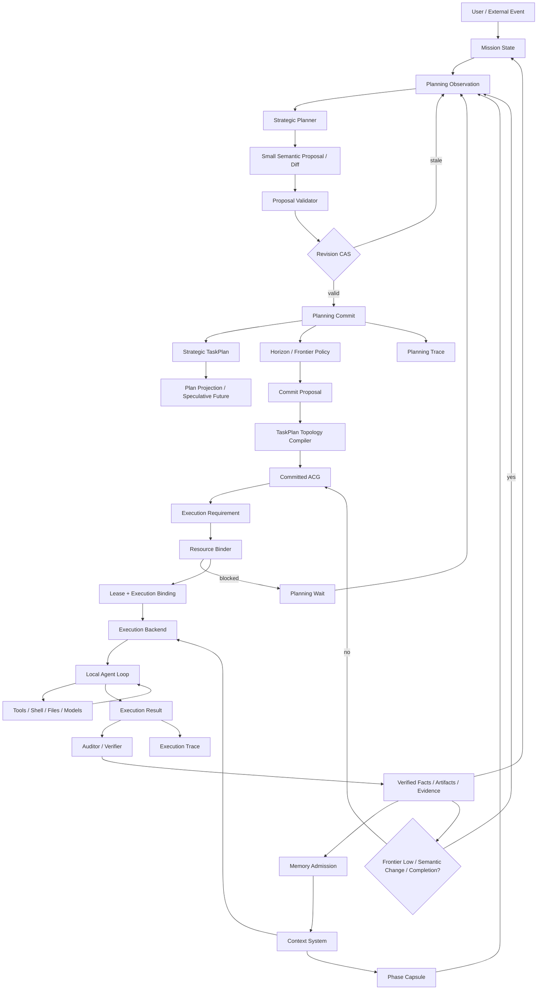

# 知弈 AgentOS 下一阶段架构收敛设计

## ——从 Runtime Replanning 到 Persistent Executive Runtime 的完整整理

> 文档性质：架构整理 / 下一阶段技术路线 / 设计决策草案
> 更新时间：2026-10-07
> 范围：本轮围绕 Rolling Planner、Progressive ACG、上下文管理、结构化输出、执行后端、资源调度、长期 Mission State 等问题的完整讨论
> 目标：保留推导过程与关键细节，作为下一阶段实现、评审、答辩和 Codex 开发提示词的统一依据

---

# 0. 本轮讨论最终收敛出的核心判断

> **当前 Planner 已经能够在运行中重新观察、重新决策，但系统仍在任务开始时生成一张完整 ACG。这个语义是否矛盾？**

检查当前代码后可以确认：

- 知弈已经具备较完整的 Runtime Planning Loop 基础；
- 当前 Planner 不是“每执行一个节点就重新规划”，而是**事件驱动式 Replanning**；
- 当前正式规划路径仍然要求 **完整 TaskPlan → 完整 ACG**；
- 当前 `revise` 更接近“版本化替换整个 Run”，还不是“冻结已执行前缀，只修改未来”；
- 当前缺少真正的 **Planning Frontier / Planning Horizon / Commitment**；
- 当前上下文系统已经具备引用、白名单、Token Budget、ContextPack、Memory、PhaseCapsule 等基础，但缺少与 Rolling Planner 对齐的 **Context Frontier 与可追溯语义压缩**；
- 当前 Planner/TaskDecomposer 仍然较依赖“大规模结构化 JSON 输出”，这会限制滚动规划的调用频率、可靠性和 Token 效率；
- 下一阶段更合理的方向不是继续强化“大 JSON Schema”，而是把 Planner 改造成类似 Git diff / tool-call 的 **小型语义操作协议**；
- AgentOS 本身应该被理解为一个长期存在的 **Persistent Executive / 总控智能体**，Codex、ZCode、Claude Code、本地 Runtime、模型、人工等是它按任务选择的专业执行资源；
- ACG 不应该表示执行 Agent 内部每一次 tool call，而应该表示 AgentOS 认为值得独立调度、恢复、审计、绑定资源的一项高层工作单元；
- 最终系统要形成：
  - 长期 Mission State；
  - 滚动战略规划；
  - 局部 ACG 承诺；
  - 异构资源绑定；
  - 专业执行 Backend 内部 Agent Loop；
  - 结果验证与事实晋升；
  - 上下文压缩与长期记忆；
  - 再次观察与滚动推进。

最核心的架构原则可以浓缩为两句话：

> **Model proposes semantics; Runtime owns structure.**
> **AgentOS owns the mission; execution agents own bounded work.**

---

# 1. 当前代码到底已经具备什么

## 1.1 当前不是“没有 Rolling Planner”，而是缺少 Rolling Planning State

当前已有 Runtime Planning Loop 的关键代码包括：

- `apps/agentOS/src/runtime/planning_loop.py`
- `apps/agentOS/src/contracts/runtime_planning.py`
- `apps/agentOS/src/runtime/planning_observation.py`
- `apps/agentOS/src/runtime/planning_wait.py`
- `apps/agentOS/src/runtime/planning_application.py`
- `apps/agentOS/src/runtime/semantic_revision.py`
- `apps/agentOS/src/runtime/acg_execution.py`
- `apps/agentOS/src/components/planner/runtime_decision.py`

当前已经具备：

1. **Observe → Decide → Apply**
2. Planning Round 持久化
3. Observation 指纹
4. Planner 决策重放
5. Crash / Restart 恢复
6. Wait / Wake
7. `requirement_available`
8. Failure → Planner
9. Runtime Resource Observation
10. Semantic TaskPlan Patch
11. Graph Version / Patch
12. Checkpoint / Superstep Barrier
13. Resource Binder readiness
14. 用户输入触发 Runtime Planner
15. Verification 触发 Runtime Planner

因此问题不是：

> “滚动 Planner 是否从零开始？”

而是：

> **现有代码有 Runtime Replanning Loop，但没有显式建模“滚动规划的承诺边界”。**

---

# 2. 当前 Runtime Planner 的真实触发方式

`ACGExecutionService` 在每一个 `superstep_completed` 后都会进入 Runtime Planning Boundary：

```text
ACG Superstep
    ↓
superstep_completed
    ↓
RuntimePlanningCoordinator.boundary(..., "progress")
```

但 `boundary()` 并不会每次都调用 Planner。

当前普通 `progress` 会检查 Verification 输出：

```python
refs = self._verification_refs(run, state)

if not set(refs) - set(loop.last_verification_refs):
    return "continue"
```

所以当前真正进入 Planner 的主要事件是：

```text
verification
failure
resume
restart
condition
user_input
exhausted
```

因此当前机制更准确的名称是：

> **Event-driven Runtime Replanning**

而不是：

> **Receding-Horizon Planning / Progressive Planning**

当前大致是：

```text
完整 ACG
   ↓
持续执行
   ↓
出现重要 Runtime Boundary
   ↓
Observation
   ↓
Planner
   ↓
continue / recover / revise / wait / complete / abort
```

这套机制本身有价值，应该保留。

---

# 3. 为什么“开局完整 ACG”与 Rolling Planner 语义冲突

当前规划链路基本是：

```text
PlanningEngine.plan()
    ↓
SemanticPlanner.plan_profile()
    ↓
TaskDecomposer
    ↓
完整 TaskPlan
    ↓
build_acg_lowering_input()
    ↓
ACGLowerer.lower()
    ↓
完整 ACG
```

关键在 `ACGLowerer._validate_steps()`。

当前要求：

```python
expected = {node.key for node in lowering_input.task_plan.nodes}

if set(steps_by_key) != expected:
    raise ValueError(...)
```

Implementation Binding 同样要求完整覆盖 TaskPlan。

也就是说当前合同实际表达的是：

> **TaskPlan 中的每一个语义任务，都必须已经被物化成可执行 ACG Node。**

所以 UI 中一开始看到 20～30 个节点不是“展示层的问题”，而是当前后端正式语义。

这与真正 Rolling Planner 的目标有冲突：

```text
战略上知道未来大概做什么
        ≠
现在就把所有未来工作承诺为可执行 Runtime Truth
```

---

# 4. 不应该走向另一个极端：完全“走一步想一步”

解决方案也不是：

```text
执行 A
↓
才想 B
↓
执行 B
↓
才想 C
```

这种零前瞻方式会损失：

- 长程一致性；
- 依赖预判；
- 资源准备；
- 并行机会；
- 风险提前发现；
- 全局产物目标；
- 验收闭环。

正确方向是：

> **Planner 可以看得很远，但 Runtime 只承诺近期稳定的一段。**

即：

```text
Global Reasoning
      ↓
Strategic TaskPlan
      ↓
Planning Horizon
      ↓
Committed Fragment
      ↓
Execution
      ↓
Observation
      ↓
Move Frontier
```

---

# 5. TaskPlan、Plan Projection、ACG、RuntimeGraph 应明确分层

## 5.1 TaskPlan：战略计划

TaskPlan 表示：

> Planner 当前对整个 Mission 的战略理解。

特点：

- 可以覆盖较长未来；
- 可以包含不确定部分；
- 可以被修订；
- 不等于已执行承诺；
- 不直接进入 Scheduler；
- 可以包含未来候选任务。

## 5.2 Plan Projection：未来预览

如果 UI 希望继续展示“完整未来图”，不要把它伪装成 canonical ACG。

应该使用：

> **Plan Projection / Planning Preview**

它可以把 TaskPlan 投影成：

```text
已完成部分
已承诺部分
未来候选部分
```

但是：

> **Plan Projection 中的未来节点永远不能进入 ready-set、ResourceBinder、Recovery 或 Executor。**

它只是认知/展示层，不是 Runtime Truth。

## 5.3 ACG：已承诺执行图

推荐的新定义：

> **ACG = Planner 已经正式承诺并经过 Compiler 校验的可执行计算图。**

因此 ACG 中的节点原则上都是：

```text
COMMITTED
```

不建议在 canonical ACG 中直接塞 `SPECULATIVE` 节点。

`SPECULATIVE` 更适合存在于 TaskPlan / Plan Projection。

这样可以避免 Scheduler 将 speculative topology 当成 executable topology。

## 5.4 RuntimeGraph：ACG 的执行实例

RuntimeGraph 继续表示：

```text
PENDING
READY
RUNNING
WAITING_REVIEW
FAILED
COMPLETED
SKIPPED
```

它回答：

> 已经承诺的工作现在执行到哪里？

而不是：

> Planner 对整个未来怎么想？

---

# 6. Planning Frontier 与 Planning Horizon

## 6.1 Planning Frontier

Planning Frontier 是：

> **已承诺执行拓扑与尚未承诺未来计划之间的边界。**

例如：

```text
TaskPlan:

A → B → C → D → E → F → G → H

Runtime:

A✓ → B✓ → C▶ → D□ | E· → F· → G· → H·
                  ↑
            Planning Frontier
```

符号可以理解为：

```text
✓ completed
▶ running
□ committed / pending
· speculative
```

## 6.2 Planning Horizon

Planning Horizon 表示：

> Planner 这一次准备向未来承诺多远。

不应该简单定义成：

```text
永远 2 个节点
永远 3 层
```

更合理的是：

> **下一段“稳定可执行切片（safe executable cut）”。**

遇到以下边界停止继续 Commit：

- 未来分支依赖当前节点输出；
- 未解决证据缺口；
- 高风险外部副作用；
- 人工 Review Gate；
- 未知 Capability；
- 未知 Resource Requirement；
- Verifier 决策点；
- Planner 明确不确定性边界；
- 需要等待外部条件；
- 关键事实仍未确认。

反之，如果区域稳定、低风险、依赖明确，可以一次 Commit 多个可并行节点。

---

# 7. Rolling Planner 如何触发

Rolling 不应该是：

> 每执行一个节点都调用一次 Planner。

推荐采用：

> **Trigger + Safe Barrier + Need**

三个层次。

## 7.1 Trigger：出现值得重新决策的事件

主要触发器：

```text
FRONTIER_LOW
SEMANTIC_CHANGE
UNRECOVERABLE_FAILURE
RESOURCE_BLOCKED
USER_INPUT
CONDITION_WAKE
COMPLETION_CANDIDATE
```

## 7.2 FRONTIER_LOW：正常滚动触发

例如：

```text
committedRemaining <= lowWatermark
```

假设：

```text
Planning Horizon = A B C D
当前已完成 A B C
只剩 D
```

此时提前触发下一轮规划，不等 D 完全结束后才开始。

这类似一个执行缓冲区：

```text
Committed Work Buffer
```

目标是让 Planner 在当前工作耗尽前补充下一段。

## 7.3 SEMANTIC_CHANGE：新事实改变未来

例如：

```text
市场调研完成
↓
发现原方案依赖设备已停产
↓
未来采购方案与成本分析失效
```

此时不必等 Horizon 耗尽，应触发未来计划修订。

但不能让系统根据任意文本“感觉重要”就 Replan。

建议 Capability / Node 可以声明：

```text
planningEffect:
    NONE
    MAY_AFFECT_FUTURE
    MUST_REPLAN
```

典型高影响能力：

```text
verification
decision
constraint_discovery
resource_discovery
```

## 7.4 FAILURE：先 Recovery，后 Planner

原则：

> **Scheduler / Recovery 能确定性处理的失败，不应该交给 Planner。**

例如：

```text
ZCode-01 掉线
↓
Binder 找到 ZCode-02
↓
自动 Rebind
```

无需 Planner。

只有：

```text
Recovery authority 无法恢复
```

才进入：

```text
REPLAN_REQUIRED
```

## 7.5 RESOURCE_BLOCKED

资源变化也不能随便触发 Planner。

只关注：

> 当前 committed frontier 相关资源。

例如：

```text
Node D committed
↓
ExecutionRequirement
↓
ResourceBinder
↓
NO_MODEL_ENDPOINT
```

这时 Runtime Planner 可以：

```text
wait(requirement_available)
```

端点出现后：

```text
condition wake
↓
重新观察
↓
重新决策
```

当前代码的 `requirement_available` 已经是这条链的重要基础。

## 7.6 USER_INPUT

用户在执行中提出：

> 不再分析方案 A，改成方案 B。

应该：

```text
user_input_pending = true
↓
到最近 Safe Barrier
↓
Observation
↓
Planner
↓
Future Revision
```

不能等原 Horizon 全部跑完。

## 7.7 CONDITION_WAKE

包括：

- 等资源；
- 等时间；
- 等节点上线；
- 等人工外部输入；
- 等某个条件变化。

Wake 本身不是“成功证明”，只是：

> 把决策权重新交回 Planner。

## 7.8 COMPLETION_CANDIDATE

这是 Progressive ACG 最容易遗漏的地方。

当：

```text
committed nodes = 0
```

不能直接认为：

```text
Mission COMPLETED
```

因为可能只是当前 Horizon 执行完。

必须检查：

```text
Acceptance 是否满足？
Expected Artifacts 是否完整？
Mandatory Work 是否结束？
Open Questions 是否仍阻塞？
Speculative Future 是否还有必要工作？
```

Planner 决定：

```text
EXPAND
```

或：

```text
COMPLETE
```

---

# 8. Safe Planning Barrier

Trigger 不意味着可以立即改图。

如果：

```text
B
├→ C running
└→ D running
```

C 产生 `MUST_REPLAN`：

不能立刻删除 D。

应该：

```text
rollPending = true
```

等当前并发 Superstep 到安全边界。

推荐 `can_roll`：

```python
can_roll =
    not state.active_step_ids
    and state.review_payload is None
    and not state.control_frames
    and checkpoint_is_durable
```

因此：

```text
Trigger
  ↓
ROLL_PENDING
  ↓
Safe Barrier
  ↓
Runtime Planning Round
```

这与当前 `RuntimePlanningCoordinator.boundary()` 的设计高度兼容。

# 9. 最终应该形成三个顶层状态域

不建议所有东西塞进一个巨大 FSM。

## 9.1 第一层：Run / Step Lifecycle FSM

当前已有。

回答：

> **任务现在能不能继续执行？**

Run：

```text
PENDING
  ↓
PLANNING
  ↓
RUNNING
  ├→ WAITING_REVIEW
  ├→ RETRYING
  ├→ FAILED
  ├→ CANCELLED
  ├→ SUPERSEDED
  └→ COMPLETED
```

Step：

```text
PENDING
 → RUNNING
 → COMPLETED

   ├→ FAILED
   ├→ RETRYING
   ├→ WAITING_REVIEW
   └→ SKIPPED
```

## 9.2 第二层：Rolling Planning State

当前缺失的核心层。

回答：

> **接下来承诺执行什么？**

概念状态：

```text
BOOTSTRAP
   ↓
ACTIVE
   ├→ ROLL_PENDING
   ├→ WAITING
   ├→ REVISING
   └→ TERMINAL
```

但真正重要的不是枚举名称，而是持有：

```text
planningFrontier
committedTaskKeys
speculativeTaskKeys
rollPending
rollReason
horizonPolicy
planRevision
graphVersion
lastCommittedRevision
```

## 9.3 第三层：Planning Round FSM

当前已经存在。

回答：

> **这一轮 Planner 决策事务进行到哪里？**

现有：

```text
OBSERVED
   ↓
DECIDED
   ↓
APPLIED

   ↘ REJECTED
```

以后可以更明确：

```text
OBSERVED
   ↓
PROPOSED
   ↓
VALIDATED
   ↓
APPLIED

   ↘ REJECTED
```

它主要负责：

- 幂等；
- 决策不重复；
- Crash Recovery；
- Planner Model Call 重放；
- Proposal Validation；
- stale decision 防护。

---

# 10. 不要再增加第四个“顶层资源 FSM”

Resource 内部当然有生命周期：

```text
UNBOUND
WAITING_RESOURCE
BOUND
LEASED
RELEASED
```

但它应该属于：

```text
Scheduler / Resource Plane
```

而不是与前三个控制状态机竞争。

同理：

- Recovery；
- Review；
- Artifact；
- Memory；
- Execution Backend Session；

都可以有各自 subsystem lifecycle，但不应上升成全局状态机。

---

# 11. 当前 Semantic Revision 的问题

目前 `RuntimePlanningDecision(action="revise")` 会：

```text
RuntimePlanningApplication
    ↓
SemanticRevisionService
    ↓
TaskPlanPatch
    ↓
重新 Lower
    ↓
创建 Replacement Run
```

新的 Run 会清理：

```text
output
steps
checkpoints
trace
completedStepIds
activeStepIds
```

源 Run：

```text
SUPERSEDED
```

新 Run：

```text
PENDING
```

因此当前 revise 的本质仍更接近：

> **版本化替换整个 Run。**

而真正 Rolling Planner 更需要：

```text
A✓ → B✓ → C✓ → D → E
```

变成：

```text
A✓ → B✓ → C✓
           ├→ X
           └→ Y → Z
```

其中：

```text
A/B/C = immutable execution history
```

Planner 只能修改：

```text
unexecuted future
```

---

# 12. 已执行前缀不可变

这是下一阶段必须冻结的不变量之一：

> **已经产生 committed execution result 的历史不能被 Planner 重写。**

例如：

```text
A✓ → B✓ → C✓ → D → E
```

Planner 以后可以：

```text
retire D
retire E
add X
add Y
```

但不能：

```text
delete A
rewrite B
pretend C never happened
```

如果过去发生的是外部副作用，更不能通过修改计划“抹去”。

---

# 13. Structure Output：当前“大 JSON”模式的问题

当前 TaskDecomposer 倾向于让模型输出：

```text
tasks[]
relations[]
controlPolicies[]
```

其中每个 Task 又包含：

```text
key
parentKey
title
objective
capabilityId
constraints
acceptanceCriteria
sourceRefs
decompositionRationale
logicalRole
workset
...
```

这会产生三个问题。

## 13.1 Token 浪费

一个 30 节点 TaskPlan 可能需要模型重新描述大量：

- ID；
- 元数据；
- 重复字段；
- relation；
- schema 形式；
- 本来由系统已经知道的信息。

## 13.2 局部错误导致整体 Repair

例如：

```text
第 17 个节点 capabilityId 非法
```

当前可能导致：

```text
完整 JSON
↓
ValidationError
↓
把错误 + 原 JSON 再给模型
↓
重新输出完整 JSON
```

这是典型的结构化输出放大。

## 13.3 模型承担了不属于模型的结构责任

例如：

```text
taskKey
nodeId
planVersion
graphVersion
binding identity
schemaHash
communication channel
resource identity
```

这些应该是 Runtime Authority，而不是模型生成内容。

---

# 14. 新原则：Model Proposes Semantics, Runtime Owns Structure

以后模型只负责：

```text
任务语义
局部目标
能力选择建议
语义依赖
未来修改意图
是否等待
是否继续
是否完成
理由摘要
```

系统负责：

```text
Identity
Version
Schema
Topology invariant
Binding
Lease
Persistence
Provenance
ExecutionRequirement
Communication Manifest
Memory Policy
```

因此链路应该改成：

```text
Mission State
    ↓
Planner
    ↓
Small Semantic Proposal
    ↓
Deterministic Materializer
    ↓
TaskPlan
    ↓
TopologyCompiler
    ↓
Committed ACG
```

---

# 15. Planner 输出应该像 Git Diff

不要：

```text
Planner → 整个 TaskPlan 新快照
```

而应该：

```text
Planner → Semantic Diff
```

例如：

```text
当前：

A✓ → B✓ → C → D → E
```

模型只提出：

```text
- retire future task: D
+ add task: X
+ add task: Y
+ edge: C -> X
+ edge: X -> Y
```

系统：

```text
TaskPlan v6
    +
Semantic Patch
    ↓
Validate
    ↓
TaskPlan v7
```

---

# 16. Planner Action 最终应该趋向小型 Tool Call

甚至可以进一步取消“大 PlannerResponse”。

给 Planner 一组窄操作：

```text
plan.add_task(...)
plan.add_dependency(...)
plan.replace_future_task(...)
plan.retire_future_task(...)
plan.commit_horizon(...)
plan.wait(...)
plan.recover(...)
plan.complete(...)
plan.abort(...)
```

例如：

```text
add_task(
    title="审计运行时资源绑定",
    capability="code_analysis"
)
```

Runtime 返回：

```text
created semanticTaskKey=...
```

然后 Planner：

```text
add_task(
    title="修复资源绑定问题",
    capability="code_edit",
    after=[...]
)
```

最后：

```text
commit_horizon(...)
```

这样：

> **结构化输出没有消失，而是从“巨大对象”变成了“小动作协议”。**

---

# 17. 为什么小型动作协议比大 JSON 稳定

旧模式：

```text
3000 tokens JSON
↓
1 个字段错误
↓
3000 tokens repair
```

新模式：

```text
几十 tokens operation
↓
某个字段错误
↓
只重试这个 operation
```

例如：

```text
UNKNOWN_CAPABILITY
```

系统可以返回：

```text
allowed:
- code_analysis
- code_edit
- verification
```

Planner 只修正一次小调用。

---

# 18. Control Plane 与 Data Plane 必须分离

结构化输出只用于 Control Plane。

## Control Plane

```text
action
taskKey
capability
status
revision
ref
decision
binding
wait condition
```

要求：

- 小；
- 严格；
- 可验证；
- 可持久化；
- 可重试。

## Data Plane

```text
代码
文件
报告
网页
搜索结果
大模型长输出
原始 Evidence
Artifact
```

要求：

- 可以很大；
- 不放进 Runtime State；
- 用 Ref 传递；
- 按需读取；
- 可以分页。

这也是当前 `ExecutionValueStore + outputRef + ContextPack` 设计应该继续强化的方向。

---

# 19. Planning Diff 必须进一步升级为事务

Git 类比不能只学 diff，还必须学 commit。

每次 Planner Proposal 必须绑定：

```text
baseRevision
```

例如：

```text
Observation @ revision=42
    ↓
Planner Proposal
    ↓
Validate
    ↓
CAS currentRevision == 42 ?
```

如果在 Planner 思考期间发生：

- 用户新输入；
- 资源状态变化；
- 节点新提交；
- Review 决定；
- 另一个 authority 更新状态；

则：

```text
currentRevision != baseRevision
```

Proposal 必须：

```text
STALE
↓
re-observe
↓
重新决策
```

不能把旧 Proposal 强行 apply 到新世界。

---

# 20. Mission State：AgentOS 长期“记住什么”

随着 AgentOS 从一次工作流转向 Persistent Executive，需要一个 Mission 级长期认知状态。

建议概念上形成：

```text
MissionState
├─ objective
├─ immutableConstraints
├─ confirmedFacts
├─ workingHypotheses
├─ decisions
├─ openQuestions
├─ activeStrategy
├─ planningFrontier
├─ committedWork
├─ currentBlockers
├─ artifacts
├─ evidence
├─ acceptanceState
├─ resourceSituation
├─ budgetState
└─ historyRefs
```

注意：

> MissionState 不一定意味着把所有模块的权威数据复制进一个巨大 JSON。

更合理的是：

- ResourcePlane 仍是资源事实 authority；
- Artifact Store 仍是 Artifact authority；
- Workflow Store 仍是 Run authority；
- Memory Store 仍是 Memory authority；
- MissionState 是 **Mission 级 canonical cognitive projection / aggregate**。

也就是说：

> AgentOS 的“认知状态”统一，但底层事实 authority 仍保持分离。

---

# 21. AgentOS 应该被理解成长期存在的主体

更准确的架构不是：

```text
Agent A ↔ Agent B ↔ Agent C
```

而是：

```text
                 AgentOS
          Persistent Executive
                  │
       ┌──────────┼──────────┐
       ▼          ▼          ▼
     Codex      ZCode      Model
       │          │          │
    bounded     bounded    bounded
    execution   execution  reasoning
       │          │          │
       └──────────┴──────────┘
                  │
                Result
                  │
                  ▼
               AgentOS
                  │
          Update Mission State
                  │
             Decide Next
```

AgentOS 自己：

- 记得 Mission 从哪里开始；
- 知道历史关键决策；
- 知道为什么改过架构；
- 知道当前做到哪里；
- 知道当前资源；
- 知道哪些任务完成；
- 知道哪些事实已验证；
- 决定下一步；
- 选择谁执行；
- 验证结果；
- 更新长期认知。

---

# 22. AgentOS 与 Codex / ZCode 的关系

Codex/ZCode 不应该只是一个 `ModelEndpoint`。

更合理：

> **Execution Backend**

它们拥有自己的局部 Agent Loop。

例如：

```text
AgentOS Node:
“检查 ResourceBinder 的 ModelDemand 编译链”

        ↓ assign

Codex Session
├─ rg
├─ read
├─ shell
├─ inspect
├─ patch
├─ test
└─ summarize
```

AgentOS 不需要把这些内部动作全部变成 ACG 节点。

---

# 23. 两层 Agent Loop

最终形成：

## AgentOS Global Loop

```text
Observe
   ↓
Plan Horizon
   ↓
Commit ACG
   ↓
Bind Resource
   ↓
Execute Node
   ↓
Verify
   ↓
Update Mission State
   ↓
Observe
   ↺
```

## Execution Backend Local Loop

```text
Reason
  ↓
Tool
  ↓
Observe
  ↓
Reason
  ↓
Tool
  ↺
```

上层负责战略。

下层负责把一件事做完。

---

# 24. 三层规划能力

可以进一步区分：

```text
Strategic Planning
    ↓
AgentOS

Tactical Planning
    ↓
Codex / ZCode / 专业 Agent

Action Planning
    ↓
shell / read / patch / tool
```

这能避免 ACG 细化成工具调用图。

---

# 25. ACG Node 的粒度必须定义

这是当前很容易遗漏的问题。

不是所有 action 都应该成为 ACG Node。

建议只有满足至少一个条件，才提升为 ACG Node：

- 需要独立资源绑定；
- 需要跨执行体依赖；
- 需要独立恢复；
- 需要独立审计；
- 需要人工审核；
- 形成独立 Artifact；
- 是重要 Planning Boundary；
- 是不可逆副作用边界；
- 需要独立预算；
- 需要独立 Acceptance。

否则留在 Execution Backend 内部。

例如：

```text
Node A：代码架构审计
   └─ Codex 内部 30 次 tool call
```

而不是：

```text
ACG:
read_1
grep_1
shell_1
read_2
patch_1
test_1
...
```

# 26. 上下文不能随历史无限增长

如果 Rolling Planner 成立，上下文也必须 Rolling。

不能每轮：

```text
Mission
+ 所有历史节点输出
+ 所有聊天
+ 所有 Artifact
+ 所有 Memory
+ 整个 ACG
```

重新塞给模型。

---

# 27. 推荐四层上下文结构

## L0：Source Truth

永不因为压缩而删除。

包括：

```text
原始文件
网页
代码
工具输出
完整模型输出
Artifact
Evidence
```

保存在：

```text
ExecutionValueStore
Content Store
Artifact Store
Memory Store
```

模型默认只得到 Ref。

## L1：Structured Node Output

节点输出应尽量包含可选结构化字段：

```text
summary
facts
decisions
constraints
openQuestions
risks
evidenceRefs
artifactRefs
```

但不是要求所有大型正文都 JSON 化。

大正文继续放 Data Plane。

## L2：ContextPack

这是：

> 当前一次 Agent 执行真正得到的最小充分上下文。

建议最终组成：

```text
ContextPack
├─ mission
├─ local step
├─ upstream
├─ memory
├─ phase capsule
└─ evidence
```

当前代码已经具备：

- allowed fields；
- sourceData；
- sourceStepIds；
- evidenceRefs；
- tokensDelivered；
- tokensAvailable；
- savingRatio；
- inputRevision；
- graphVersion；
- run/step ownership。

## L3：Phase Capsule / Mission Memory

用于把较远历史从 Hot Context 中移出。

例如：

```text
Phase 1:
A → B → C → D
```

完成后：

```text
A/B/C/D
↓
PhaseCapsule
```

未来上下文不再默认携带全部 A/B/C/D 正文。

但 Capsule 保留：

```text
sourceMemoryRefs
evidenceRefs
artifactRefs
```

必要时可以重新展开。

---

# 28. Context 应采用 Pull，而不是 Push

错误方式：

```text
A 做完
↓
把完整 A 发送 B
↓
B 做完
↓
把 A+B 发送 C
↓
上下文持续膨胀
```

正确方式：

```text
A output
↓
Store
↓ outputRef

B 需要：
recommendation
evidenceRefs

↓
CommunicationBroker
↓
按白名单读取
```

数据默认留在原地。

消费者按需拉取。

---

# 29. Context Frontier

Planning 有 Frontier。

Context 也应该有 Frontier。

例如：

```text
过去                             当前                       未来
────────────────────────────────────────────────────────────
Capsule1 | Capsule2 | C | D | E |      F G H I
                     ↑
               Context Frontier
```

越远的历史：

```text
raw output
↓
structured memory
↓
phase capsule
```

越接近当前：

```text
保留更高细节
```

可以理解为 AgentOS 的 Working Set。

---

# 30. 三种不同的压缩机制

不能只设计一个 `compress()`。

## 30.1 Projection

最安全。

```text
原输出:
summary
rawData
evidence
debug
recommendation

↓ allowedFields

summary
evidence
recommendation
```

当前系统已经较成熟。

## 30.2 Selection

从允许字段 / Memory 中选择相关部分。

当前已有：

```text
field value / token
lexical retrieval
vector retrieval
RRF
token budget
```

未来应该继续强化 relevance。

## 30.3 Semantic Compression

当前明显不完整。

现在 `compress_text()` 本质上只是：

```text
text[:limit] + …
```

真正的语义压缩应该：

```text
Historical Facts
↓
Semantic Compressor
↓
Structured Capsule
```

但不能让模型任意生成一篇摘要。

建议固定：

```text
confirmedSummary
keyFacts
constraints
decisions
risks
openQuestions
evidenceRefs
```

然后 deterministic validator 检查关键字段。

---

# 31. 哪些信息绝不能被“摘要掉”

建议定义：

> **Lossless Critical Set**

包括：

```text
Mission Objective
Hard Constraints
Acceptance Criteria
Formal Decisions
Open Questions
Current Blockers
Resource Requirements
Artifact Identity
Evidence Refs
Review / Approval State
Failure Facts
External Side Effects
```

这些必须结构化保存。

例如：

```text
预算 <= 80 万
```

不能被摘要成：

```text
“预算应合理控制”
```

---

# 32. Planner Context 与 Executor Context 必须分离

## Planner Context

Planner 需要：

```text
Mission Goal
TaskPlan
Planning Frontier
Committed Horizon
Phase Capsules
Blockers
Verification Results
Resource Facts
Open Questions
Acceptance State
User Input
```

Planner 不需要默认看到所有 Node 正文。

## Executor Context

Execution Backend / Node 需要：

```text
Step Goal
Local Contract
Direct Parent Outputs
Relevant Memory
Required Evidence
Current Phase Capsule
Tool / Workspace Context
```

因此：

```text
                  Context Plane

                     Mission
                       │
             ┌─────────┴───────────┐
             ▼                     ▼
       Planner Context        Node Context
             │                     │
TaskPlan / Frontier         Parent outputs
Capsules                    Memory retrieval
Blockers                    Evidence
Resource facts              Local contract
Acceptance
```

---

# 33. Plan Revision 后 Context 必须失效

这是一个重要遗漏。

假设：

```text
C → D → E
```

Planner 改成：

```text
C → X → Y
```

那么此前为 D 生成的：

- ContextPack；
- Memory Retrieval；
- ExecutionRequirement；
- Resource Binding；
- speculative summary；

很多都必须失效。

建议所有 derived state 带：

```text
sourceRevision
planVersion
graphVersion
inputRevision
```

源状态变化后：

```text
derived object => stale
```

重新物化。

---

# 34. Phase Capsule 的生成时机

最自然的触发点：

> **Planning Frontier 向前移动时。**

例如：

```text
A B C | D E
```

当：

- A/B/C 已完成；
- 后续 committed/speculative 工作不再直接依赖其详细正文；

则：

```text
A/B/C → COMPACTABLE
```

生成：

```text
PhaseCapsule(ABC)
```

Hot Context 中移除详细正文。

原始内容继续保留在 Store。

---

# 35. Execution Backend 返回的内容不能直接成为“系统事实”

例如 Codex 返回：

```text
“已经修复全部问题。”
```

这只是：

> **Agent Claim**

不能直接写入：

```text
confirmedFacts
```

推荐统一：

```text
ExecutionResult
├─ status
├─ summary
├─ artifactRefs
├─ evidenceRefs
├─ changedResources
├─ verificationHints
└─ telemetry
```

然后经过：

```text
Auditor / Verifier
```

才能将某些内容晋升成：

```text
Confirmed Fact
```

---

# 36. 建议建立 Fact Lifecycle

例如：

```text
PROPOSED
   ↓
OBSERVED
   ↓
VERIFIED
```

也允许：

```text
CONTESTED
STALE
REVOKED
```

至少要明确区分：

```text
Agent said X
```

和：

```text
AgentOS verified X
```

否则 AgentOS 虽然是总控，仍会被执行 Agent 的自我报告污染。

---

# 37. Resource Scheduling 与 Rolling Planner 如何结合

理想节点生命周期：

```text
TaskPlan speculative
      ↓
Planner commit
      ↓
ACG committed node
      ↓
ExecutionRequirement
      ↓
ResourceBinder
      ↓
Lease
      ↓
ExecutionBinding
      ↓
READY
      ↓
RUNNING
      ↓
COMPLETED
      ↓
Observation
```

重要原则：

> **Speculative Task 不参与 Resource Binding。**

否则一开始仍然会给几十个未来节点抢资源。

---

# 38. 当前 Resource Plane 的真实基础

当前已经有：

- `ExecutionRequirement`
- `ResourceBinder`
- Runtime eligibility
- trust / placement / capabilities
- capacity
- lease
- ModelEndpoint candidate
- rebind
- resource readiness
- `requirement_available`
- Planner resource observation

因此资源控制面已经有较强基础。

---

# 39. 当前 ModelDemand 的真实缺口

当前 `ExecutionRequirement.model` 已存在。

`ModelDemand` 也存在：

```text
required_features
min_context_tokens
preferred_model_ids
allowed_endpoint_ids
excluded_endpoint_ids
```

Binder 也能够：

```text
requirement.model
↓
model_candidates(...)
```

但是当前生产 Compile Path 中：

```text
BindingManifest
```

默认仍没有真正生成 ModelDemand。

因此普通任务常常仍回落到：

```text
AgentProfile.model_provider
AgentProfile.model_name
default_model_binding
```

所以：

> Resource Binder 已经“会选”，但生产 Planner/Compiler 还没有真正告诉它“任务需要什么模型”。

这一项仍然需要后续收敛。

---

# 40. Execution Backend 与 Model Endpoint 必须分开

例如 ZCode：

不应该直接被当成：

```text
ModelEndpoint
```

更合理：

```text
Execution Backend
```

一个执行 Backend 内部可以：

- 自己调用模型；
- 自己使用 shell；
- 自己管理短程 Agent Loop；
- 自己调用文件系统；
- 自己执行测试。

因此节点需求未来可能同时包含：

```text
execution backend requirement
+
model requirement
+
tool requirement
+
workspace requirement
```

不能混成一个 ID。

---

# 41. 避免“双重调度”

如果 AgentOS 已经决定：

```text
Node X → ZCode Runtime
```

ZCode 内部可以自由进行：

```text
read
shell
patch
test
```

但不应该再和 AgentOS 同时竞争全局 Mission 调度权。

推荐：

## AgentOS authority

- Mission；
- Strategic Plan；
- ACG；
- dependencies；
- resource selection；
- cross-node retries；
- recovery；
- long-term memory；
- provenance；
- artifact identity；
- global approval；
- budget。

## Execution Backend authority

- 当前 bounded task 的局部 reasoning；
- tool loop；
- repo interaction；
- command sequence；
- 局部 retry；
- 局部 tactical plan。

---

# 42. Side Effects：Rolling Planner 必须面对真实世界不可逆性

这是一个必须补的设计。

读代码、搜索资料可以 Replan。

但：

```text
发邮件
创建 PR
删除文件
付款
修改生产数据库
调用真实外部系统
```

执行后不能通过：

```text
retire node
```

假装没发生。

建议节点或 capability 声明：

```text
effectClass:
    PURE
    REVERSIBLE
    COMPENSATABLE
    IRREVERSIBLE
```

## 42.1 PURE

例如：

```text
read
analyze
search
calculate
```

可以自由重算。

## 42.2 REVERSIBLE

有明确逆操作。

例如：

```text
创建临时文件
修改可恢复配置
```

## 42.3 COMPENSATABLE

无法真正撤回，但可以通过补偿动作修正。

例如：

```text
创建工单
更新某个业务状态
```

## 42.4 IRREVERSIBLE

例如：

```text
发送外部通知
支付
不可撤销提交
```

必须有更强：

- Review；
- Commit Barrier；
- Audit；
- Idempotency；
- Confirmation。

Planner 对已完成 Side Effect 只能：

```text
append compensation
```

不能改写历史。

---

# 43. Budget 也需要变成 Mission 级控制量

长期 Agent 很容易无限消耗。

建议 Mission 逐渐拥有：

```text
tokenBudget
costBudget
timeBudget
planningBudget
retryBudget
externalCallBudget
```

当前已有的：

- `max_rounds`
- Communication token budget
- model concurrency
- max cost / max latency
- retry limit

可以逐步统一到 Mission Budget。

---

# 44. Rolling Planner 的 Liveness

Rolling Planner 会产生一个新风险：

```text
observe
↓
revise
↓
observe
↓
revise
↓
...
```

永远不结束。

所以需要：

```text
maxPlanningRounds
maxNoProgressRounds
repeatedDiffDetection
budgetExhausted
minimumProgressMetric
```

例如连续三轮：

```text
Mission State 没有新增 confirmed fact
Artifact 没增加
Blocker 没减少
Frontier 没推进
```

就应该：

```text
WAIT / HUMAN_REVIEW / ABORT
```

而不是继续模型循环。

---

# 45. Completion 也必须成为严格 Authority

Planner 不能因为：

```text
“我觉得完成了”
```

就结束。

推荐：

```text
Acceptance satisfied
AND
no unresolved mandatory work
AND
required artifacts sealed
AND
no blocking open question
AND
no unresolved high-risk side effect
```

之后 Planner 的：

```text
complete
```

才允许被 Apply。

---

# 46. 未来 Speculative Plan 可以支持候选分支

长期任务未必总能提前确定唯一未来。

例如：

```text
             ┌→ Strategy A
Frontier ────┤
             └→ Strategy B
```

可以允许：

```text
candidate plan branches
```

但只有：

```text
committed branch
```

进入 ACG。

这与“概率空间可视化”也很契合。

短期不必第一版实现，但合同最好不要堵死。

---

# 47. Planning Trace 与 Execution Trace 应彻底分开

## Planning Trace

记录：

```text
Observation
Proposal
Rationale Summary
Validation
Commit
Reject
Wait
Revision
Frontier Move
```

回答：

> **为什么系统决定这样做？**

## Execution Trace

记录：

```text
tool
model
command
artifact
node start
node finish
resource binding
failure
retry
```

回答：

> **这件事具体怎么做的？**

---

# 48. 不要保存隐藏 Chain-of-Thought

可以保留模型的：

```text
Observation
Decision
Rationale Summary
Semantic Diff
Validation Result
```

不应该把内部隐藏推理当成系统状态。

推荐 Planning Commit：

```text
PlanningCommit
├─ observationId
├─ baseRevision
├─ action
├─ rationaleSummary
├─ proposalRef
├─ validationResult
├─ resultingRevision
└─ timestamp
```

这样已经足够解释系统决策。

---

# 49. Planning History 可以像 Git Log

UI 可以展示：

```text
● v18  Expand verification horizon
│      + verification
│      + artifact_generation
│
● v17  Replace resource strategy
│      - generic_resource_check
│      + model_demand_compile
│
● v16  Repository architecture confirmed
│
● v15  Initial planning
```

展开某一条：

```text
Observation
Decision
Reason
Diff
Validation
Commit
```

这比单纯：

```text
planner.runtime.observed
planner.runtime.requested
planner.runtime.decided
```

更有意义。

# 50. 下一阶段完整功能图



---

# 51. 更细的 Runtime 主链

```text
Mission
  ↓
MissionState@revision=N
  ↓
Planning Observation
  ↓
Planner
  ↓
Semantic Diff
  ↓
Validation + CAS
  ↓
Planning Commit N+1
  ↓
TaskPlan
  ↓
Horizon Policy
  ↓
Commit Fragment
  ↓
TopologyCompiler
  ↓
Committed ACG
  ↓
ExecutionRequirement
  ↓
ResourceBinder
  ↓
Lease / Binding
  ↓
Execution Backend
  ↓
Local Agent Loop
  ↓
ExecutionResult
  ↓
Verification
  ↓
Confirmed Facts + Artifact + Evidence
  ↓
Mission State Update
  ↓
Context / Capsule Update
  ↓
Planning Trigger?
  └─────────────────────────↺
```

---

# 52. 示例：检查代码仓库、修复问题、生成报告

用户：

```text
检查这个仓库，修复启动失败，并生成报告。
```

## 52.1 Strategic Plan

AgentOS 不一定开局生成 30 个 ACG Node。

TaskPlan 可以先有：

```text
1. Diagnose repository
2. Repair root cause
3. Verify fix
4. Produce report
```

## 52.2 Initial Horizon

只 Commit：

```text
Node A:
Repository Diagnosis
```

## 52.3 Resource Binding

```text
Requirement:
execution_backend=code_agent
workspace=repo
tools=read/shell
```

Binder 选择：

```text
ZCode / Codex
```

## 52.4 Backend Local Loop

内部：

```text
rg
↓
read file
↓
run tests
↓
inspect failure
↓
read more
↓
return diagnosis
```

这些不需要变成 ACG Node。

## 52.5 Verification / Mission Update

返回：

```text
ExecutionResult
```

Auditor 验证：

```text
启动失败根因 = 某条可验证的真实原因
```

Mission State：

```text
confirmedFacts += root cause
```

## 52.6 Rolling Trigger

如果该事实：

```text
MUST_REPLAN
```

Planner 可以提出：

```text
- retire generic repair
+ add targeted_fix
+ add focused_validation
```

## 52.7 Commit Next Horizon

新 ACG：

```text
Targeted Fix
    ↓
Focused Validation
```

分别分配给合适 Backend。

## 52.8 Completion

Verifier + Artifact Acceptance 确认：

```text
代码修改已通过
测试已通过
报告存在
Acceptance 全部满足
```

Planner 才允许：

```text
COMPLETE
```

---

# 53. 下一阶段建议开发顺序

## P0：先恢复测试基线

当前之前审计过的已知问题仍应先清理：

- Backend architecture tests 中 `Map<String,Object>` / `Object` projection 问题；
- AgentOS schema / old fixture baseline failure；
- 不允许通过放宽 Architecture Guard 或删除测试变绿。

目标：

```text
Backend GREEN
AgentOS GREEN
Frontend GREEN
```

## PR-A：Planning Contract Reduction

目标：

> 取消“模型生成完整 Runtime Structure”的正式依赖。

新增/重构：

```text
PlanningProposal
PlanOperation
PlanningCommit
baseRevision
rationaleSummary
```

让模型只输出：

```text
small semantic diff
```

Materializer 负责生成完整 TaskPlan。

## PR-B：Rolling Planning State + Progressive ACG

加入：

```text
PlanningFrontier
Committed Horizon
rollPending
rollReason
Commit Fragment
```

目标：

```text
TaskPlan != canonical committed ACG
```

并支持：

```text
TaskPlan
↓ bounded commit
ACG
```

## PR-C：Immutable Execution Prefix + Same-Mission Graph Evolution

解决当前：

```text
revise = replacement Run
```

与 Rolling Planner 的冲突。

必须保证：

```text
completed history immutable
```

未来 Plan 修改不重跑已提交节点。

如果短期仍用 successor Run 作为兼容实现，也必须：

- 复用 committed output；
- 明确历史前缀；
- 不重新执行 completed work；
- 维持同一 Mission 规划连续性。

## PR-D：Context Frontier + Phase Capsule

实现：

```text
context frontier
compactable history
phase capsule
source revision
context invalidation
```

并正式引入可追溯 Semantic Compressor。

## PR-E：Compiled ModelDemand / Resource Requirement Convergence

让真正的：

```text
semantic requirement
↓
compiler
↓
ModelDemand
↓
ExecutionRequirement
↓
ResourceBinder
```

跑通。

逐步退出：

```text
AgentProfile/default model
```

作为普通生产选择机制。

## PR-F：External Execution Backend Protocol

定义统一：

```text
ExecutionBackend
prepare
execute
cancel
stream events
return ExecutionResult
```

不允许 Scheduler 出现：

```text
if backend == "zcode"
```

## PR-G：ZCode / Codex First Backend

跑真实：

```text
Node
↓
ResourceBinder
↓
ZCode/Codex
↓
tool loop
↓
ExecutionResult
```

形成第一条异构执行链。

## PR-H：Truth Elevation + Side Effect Governance + Budget

补：

```text
Fact lifecycle
effectClass
side-effect commit barrier
Mission budget
no-progress detection
```

## PR-I：Planning / Execution UI Convergence

UI 显示：

```text
Strategic Plan
Committed ACG
Planning Frontier
Planning History
Execution Trace
Resource Binding
Context / Capsule
```

不要再把：

```text
speculative future
```

画成与 committed node 完全相同的 runtime truth。

---

# 54. 建议冻结的架构不变量

下一阶段建议把以下规则写进 Architecture Guard / Tests。

1. **模型不能直接生成或指定 Runtime Identity。**
2. **模型不能直接选择 concrete Resource。**
3. **模型不能直接写 graphVersion / planRevision。**
4. **TaskPlan 是战略语义；ACG 是 committed executable topology。**
5. **Speculative task 不进入 Scheduler。**
6. **Completed execution history 不得被 Planner 重写。**
7. **Planning Proposal 必须绑定 baseRevision。**
8. **Stale Proposal 必须拒绝。**
9. **只有 Runtime/Compiler 可以 Materialize Structure。**
10. **上下文正文不进入 checkpoint。**
11. **Context derived object 必须携带 source revision。**
12. **大内容走 Ref / Artifact / Store，不走 Control JSON。**
13. **Execution Backend 的 claim 不是 confirmed fact。**
14. **不可逆副作用不能通过 Replan 抹除。**
15. **Completion 必须经过 Acceptance。**
16. **Recovery 可解决的问题不升级给 Planner。**
17. **Planning Loop 必须有 budget 和 no-progress guard。**
18. **Planning Trace 与 Execution Trace 分离。**
19. **外部 Backend 不拥有 Mission 级规划权。**
20. **一个 ACG Node 应该对应值得独立调度/恢复/审计的工作单元。**

---

# 55. 下一阶段测试重点应该变化

未来不能只测：

```text
“100 个节点能否执行完成”
```

更重要的是控制系统性质。

## Rolling Planner

- 初始 ACG 不包含全部 speculative Task；
- Frontier Low 会触发 Expansion；
- 非关键普通节点完成不会频繁调用 Planner；
- MUST_REPLAN 会在 Safe Barrier 生效；
- Horizon exhausted 不会直接 Completed；
- completed prefix 永远不会被未来 Patch 删除。

## Planning Transaction

- 同 Observation 只 commit 一次；
- Crash 后 observed round 可恢复；
- decided 未 apply 可继续；
- stale `baseRevision` 必须拒绝；
- 重复 diff 幂等；
- rejected proposal 不污染 Mission State。

## Context

- speculative node 无 ContextPack；
- revision 变化后旧 ContextPack stale；
- PhaseCapsule 可追溯回 sourceRefs；
- Hard Constraint 不因 Semantic Compression 丢失；
- Context size 不随完整任务历史线性增长；
- 大字段支持按需分页读取。

## Resource

- speculative node 不获取 Lease；
- committed node 才生成 Requirement；
- NO_MODEL_ENDPOINT → wait；
- incompatible endpoint 不唤醒；
- readiness wake 不代表 Lease；
- resource disappears before bind → revalidate；
- rebind 不重跑 committed upstream。

## Execution Backend

- backend 内部 tool call 不膨胀 ACG；
- backend crash 可局部恢复；
- backend claim 不自动晋升 confirmed fact；
- backend changed files / artifacts 有 evidence；
- cancellation 可传播。

## Side Effect

- PURE node 可安全重放；
- IRREVERSIBLE node 不自动重放；
- stale replan 不能重复副作用；
- compensating action 形成新历史，不修改旧历史。

---

# 56. 当前系统定位应重新描述

不建议继续主要描述为：

> 多 Agent DAG 平台。

更准确：

> **知弈 AgentOS 是一个面向长程职业任务的 Persistent Executive Runtime。系统以 Mission 为长期认知与治理边界，通过滚动规划持续维护任务状态，将当前确定的工作物化为 committed ACG，并按能力、资源、风险与预算选择异构执行后端完成局部任务；执行结果经过验证、记忆、上下文压缩与证据归档后重新进入 Mission State，驱动下一轮规划。**

---

# 57. 与 Codex 的关系应如何表述

不是：

```text
AgentOS = 更大的 Codex
```

也不是：

```text
Codex = AgentOS 内一个普通 Tool
```

更准确：

```text
AgentOS
= Mission-level Executive

Codex / ZCode
= intelligent Execution Backend
```

关系类似：

```text
AgentOS:
“现在为什么要做这件事、谁来做、什么时候做、失败怎么办、结果是否可信、下一步是什么”

Codex:
“既然这件事交给我，我如何通过代码、shell、测试、patch 把它做完”
```

---

# 58. 本轮讨论最终形成的完整抽象

```text
                           ┌─────────────────────┐
                           │     Mission State    │
                           │ long-lived executive│
                           └──────────┬──────────┘
                                      │
                               Observation
                                      │
                                      ▼
                           ┌─────────────────────┐
                           │ Strategic Planner   │
                           └──────────┬──────────┘
                                      │
                              Semantic Diff
                                      │
                                      ▼
                       ┌──────────────────────────┐
                       │ Validate + CAS + Commit  │
                       └─────────────┬────────────┘
                                     │
                              Strategic TaskPlan
                                     │
                        ┌────────────┴────────────┐
                        │                         │
                        ▼                         ▼
                Plan Projection             Horizon Policy
                 speculative                     │
                                                 ▼
                                         Commit Fragment
                                                 │
                                                 ▼
                                        Topology Compiler
                                                 │
                                                 ▼
                                         Committed ACG
                                                 │
                                                 ▼
                                     Execution Requirement
                                                 │
                                                 ▼
                                         Resource Binder
                                                 │
                                    ┌────────────┴────────────┐
                                    │                         │
                                 blocked                    bound
                                    │                         │
                                    ▼                         ▼
                                  Wait               Execution Backend
                                    │                         │
                                    └───────┐         Local Agent Loop
                                            │                 │
                                            │                 ▼
                                            │         Execution Result
                                            │                 │
                                            │                 ▼
                                            │          Auditor/Verifier
                                            │                 │
                                            │                 ▼
                                            │         Confirmed Facts
                                            │         Artifact/Evidence
                                            │                 │
                                            │                 ▼
                                            └──────── Mission State
                                                              │
                                                   Context / Memory
                                                              │
                                                       Phase Capsule
                                                              │
                                                              └──→ next Observation
```

# 59. 仍需要明确的设计问题

以下问题不建议继续“边写边决定”，应在正式 PR 前明确。

## 问题 1：Mission State 是单独持久化的实体，还是多个 Authority 的聚合投影？

两种方案：

### A. 单一 MissionState Store

优点：

- revision / CAS 简单；
- Planner 读取简单；
- 状态统一。

风险：

- 容易复制 Resource / Artifact / Workflow 真相；
- 形成新的 God Object。

### B. MissionState 是 canonical projection

底层 authority 不变：

```text
Workflow Store
Resource Plane
Memory Store
Artifact Store
Decision Store
```

Mission State 保存：

```text
认知事实 + 引用 + revision
```

更符合现有 architecture authority 思想。

当前更推荐 B。

---

## 问题 2：TaskPlan 本身是否允许 speculative branch？

两个方向：

```text
TaskPlan = 全局战略 + speculative
ACG = committed only
```

或：

```text
TaskPlan = committed semantic plan
PlanProjection = speculative future
```

当前更推荐第一种，但必须严格保证 TaskPlan speculative 不自动 lower 全量 ACG。

---

## 问题 3：第一版 Horizon Policy 怎么做？

不要一开始做复杂强化学习或概率规划。

可以先采用确定性规则：

> Commit 下一段 safe executable cut。

停止条件：

- unresolved branch；
- verifier gate；
- side-effect gate；
- resource uncertainty；
- evidence dependency；
- user decision；
- explicit planner uncertainty。

---

## 问题 4：Rolling Graph Evolution 是否继续创建 Replacement Run？

短期可以保留 successor Run 作为兼容机制。

但长期语义上：

> Mission Planning History 应该连续。

必须决定：

- graph version 是否在 same Run 演进；
- 还是 Run 表示一个 immutable execution epoch；
- Mission 下有连续 epoch。

如果继续 successor Run，需要明确“Run 是执行 epoch”，不要把它和 Mission 混为一谈。

---

## 问题 5：Semantic Proposal 用单次小 JSON 还是 Planner Tool API？

第一阶段可以：

```text
small discriminated union JSON
```

长期更推荐：

```text
planner tool calls
```

例如：

```text
plan.add_task
plan.retire_future
plan.commit
plan.wait
```

因为更利于局部校验与局部重试。

---

## 问题 6：PhaseCapsule 的 Semantic Compressor 由什么模型执行？

需要确定：

- 是否使用当前 Planner Model；
- 是否独立轻量模型；
- 是否允许 LLM；
- 如何校验关键字段；
- 如何评估事实遗漏率；
- 何时重新展开 source refs。

第一版必须把 Hard Constraints / Decisions / EvidenceRefs 做 deterministic projection，再让模型只生成 Summary/Insight。

---

## 问题 7：Execution Backend Session 是否跨 Node 持久存在？

可能有两种：

```text
per-node session
```

或：

```text
per-mission reusable backend session
```

长期 reuse 有上下文优势，但有状态污染风险。

建议第一版：

> bounded per-node/per-work-unit session，跨节点通过 AgentOS Context/Memory 传递。

---

## 问题 8：Backend 是否允许自行选择模型？

需要明确 AgentOS 和 Backend 的 authority。

可能：

- AgentOS 绑定 Backend，Backend 内部自己选模型；
- AgentOS 同时指定 ModelDemand；
- Backend 支持 AgentOS model binding injection。

不能出现两套全局模型调度器互相覆盖。

---

## 问题 9：Planning Frontier 与 Context Frontier 是否必须同步？

不一定完全同步。

可能：

```text
Planning Frontier 已前进
```

但旧节点仍因某个 future task 需要保持 Hot Context。

所以 Context Frontier 应该由依赖与 relevance 决定，而不是简单等于 Planning Frontier。

---

## 问题 10：如何定义“Planning Progress”？

需要给 liveness 一个可计算指标。

候选：

```text
confirmedFactCount ↑
artifactAcceptance ↑
blockerCount ↓
mandatoryRemaining ↓
frontierPosition ↑
unresolvedQuestionCount ↓
```

否则无法判断 Planner 是否在空转。

---

## 问题 11：什么时候保留多个 speculative candidate？

短期可以不做。

但 Plan Contract 不要假设未来只能有唯一 branch。

后续可为：

```text
candidatePlans[]
confidence
expectedCost
expectedRisk
```

留接口。

---

## 问题 12：用户如何介入 Rolling Planner？

需要定义用户操作：

```text
修改目标
新增约束
取消未来任务
要求立即停止
批准 side effect
选择 candidate
要求重跑
```

每种操作应该进入：

```text
Mission Revision
```

而不是直接改 ACG。

---

# 60. 当前最值得先冻结的三个问题

如果下一轮只能先处理三个：

## 第一：Mission State / Revision Authority

先回答：

> Planner 到底在修改什么？

没有这个，Diff/CAS 没有基准对象。

## 第二：Planning Diff + Commit Transaction

先建立：

```text
Observation@revision
→ Proposal
→ Validate
→ CAS
→ Commit
```

这是 Rolling Planner 的事务核心。

## 第三：Immutable History + Side Effect Boundary

先规定：

```text
历史不能重写
外部事实不能假装没发生
```

否则 Progressive Replanning 越强，系统越危险。

---

# 61. 下一阶段最小可交付目标

不要一口气实现全文所有能力。

一个合理的下一阶段 MVP 是：

```text
1. Mission Revision
2. Small Planning Proposal
3. Planning Frontier
4. Committed-only ACG
5. rollPending
6. safe barrier
7. bounded horizon expansion
8. immutable completed prefix
9. Context invalidation by revision
10. Planning History
```

暂时：

- 不接 ZCode；
- 不做复杂 candidate probability；
- 不做 GPU 物理调度；
- 不做复杂自主副作用；
- 不做学习型 Horizon Policy。

---

# 62. 下一阶段完成后系统应该呈现的行为

用户提交一个复杂长程任务。

系统不是：

```text
一次生成 27 Node
↓
全部固定
↓
执行到底
```

而是：

```text
理解 Mission
↓
形成战略 TaskPlan
↓
只 Commit 第一段稳定工作
↓
执行
↓
产生新事实
↓
更新 Mission State
↓
压缩历史 Context
↓
滚动 Planner
↓
Diff Future Plan
↓
Commit 下一段
↓
选择新的 Agent / Backend / Model
↓
继续执行
↓
直到 Acceptance 真正满足
```

从用户视角，它应该像一个长期负责项目的人：

> 它知道整个任务从哪里开始，知道当前为什么做到这里，会根据结果改变计划，会把具体工作交给更合适的专业执行体，会记住真正重要的历史，同时不会把所有历史都重新塞进模型，也不会让执行 Agent 随意改写整个任务状态。

---

# 63. 最终结论

这轮讨论最大的变化不是“给 Planner 加一个状态”。

而是重新明确了 AgentOS 的主体性：

```text
AgentOS ≠ 一次 Planner + 固定 DAG Executor
AgentOS ≠ 一堆平级 Agent 互相聊天
AgentOS ≠ 一个更复杂的 Prompt Workflow
```

目标应该是：

> **一个长期存在、可持续观察、规划、委派、验证、记忆、恢复和重新规划的 Executive Runtime。**

ACG 的角色也随之变化：

> **ACG 不是 AgentOS 的全部思考，也不是完整未来；它只是 AgentOS 当前已经承诺执行的计算视图。**

TaskPlan 表示：

> 当前战略理解。

Mission State 表示：

> 长期认知与任务事实。

Planning Diff 表示：

> Planner 希望改变未来的局部语义操作。

Planning Commit 表示：

> 系统接受的正式战略变化。

Execution Backend 表示：

> 被委派完成一项 bounded work 的专业执行体。

ContextPack 表示：

> 当前执行真正需要的最小充分信息。

PhaseCapsule 表示：

> 可追溯、可展开的历史压缩。

ResourceBinder 表示：

> 谁真正获得执行资源。

Verifier / Auditor 表示：

> 哪些执行结果可以晋升成 AgentOS 的可信事实。

最终主循环是：

```text
Observe
→ Think
→ Diff
→ Validate
→ Commit
→ Bind
→ Execute
→ Verify
→ Remember
→ Compress
→ Observe
```

这应该成为知弈 AgentOS 下一阶段所有模块设计的统一主线。
